Accuracy Summary
================
Mikey Saugstad
October 10, 2017

-   [Preliminary Notes](#preliminary-notes)
-   [Comparing Anon vs. Registered Volunteers vs. Turkers](#comparing-anon-vs.-registered-volunteers-vs.-turkers)
    -   [Raw Accuracy](#raw-accuracy)
    -   [Recall](#recall)
    -   [Precision](#precision)
    -   [F-measure](#f-measure)
    -   [Specificity](#specificity)
-   [Volunteer Data](#volunteer-data)
    -   [Raw accuracy](#raw-accuracy-1)
    -   [Recall](#recall-1)
    -   [Precision](#precision-1)
    -   [F-measure](#f-measure-1)
    -   [Specificity](#specificity-1)
-   [Turker Data](#turker-data)
    -   [Comparing effects of number of turkers and vote type on accuracy](#comparing-effects-of-number-of-turkers-and-vote-type-on-accuracy)
-   [Removing Low Severity](#removing-low-severity)
    -   [How many low severity problems are there?](#how-many-low-severity-problems-are-there)
-   [Incorporating single-user clustering](#incorporating-single-user-clustering)
    -   [Label counts](#label-counts)
    -   [Recall](#recall-4)
    -   [Precision](#precision-4)
    -   [Specificity](#specificity-4)
    -   [Variance in accuracy](#variance-in-accuracy)

Preliminary Notes
-----------------

-   For all graphs relating to accuracy, each data point is a single user (or a set of clustered users) over a single condition (i.e., 2-3 routes, or 2000/4000ft).
-   In the case of 5 meter and 10 meter segment granularity, raw accuracy and specificity get a huge boost from a large number of true negatives.
-   For NoSidewalk issues, these should only be looked at in the street-level, binary case. Both because there is not an established way to label, and because that is the level of granularity that users would actually care about.
-   When clustering, we choose the "average" of the points (using haversine distance, etc, etc), and when we want to represent the cluster on a panorama, we show the label that is closest to this "average".

Comparing Anon vs. Registered Volunteers vs. Turkers
----------------------------------------------------

This section has a series of boxplots that compare performance of anonymous volunteers, registered volunteers, a single turker, and 5 turkers with majority vote. Here, a the single turker is the first turker to complete that set of routes.

For each granularity and label type, an ANOVA test was run, with the p-value being reported in the top-right corner of each boxplot. I appended a `**` if the p-value was less than 0.01, and just a `*` if the p-value was less than 0.05, to make finding significant results easier.

To make room for the p-value on each boxplot, I expanded the y-limit past 1.0, and then added a dotted line at the 1.0 mark so that we still have that reference point. However, it makes the graphs look a bit ugly, so LMK if you want to remove it.

*Takeaways*:

-   Missing curb ramp labels precision is very low for all worker types, indicating that verification would be extremely useful for this label type, in particular.

#### Raw Accuracy

Defined as $\\frac{TP + TN}{TP + TN + FP + FN}$. Just the percentage of things they got correct.

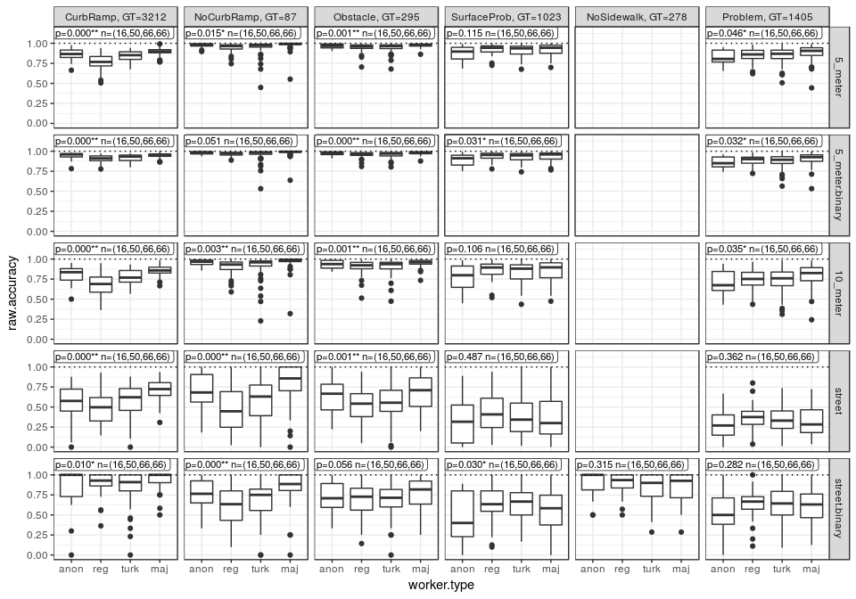

#### Recall

Defined as $\\frac{TP}{TP + FN}$. High recall means that they found most of the issues/features.

#### Precision

Defined as $\\frac{TP}{TP + FP}$. High precision means that they rarely placed a label when they shouldn't have.

#### F-measure

Defined as $2 \* \\frac{precision \* recall}{precision + recall}$. It is essentially a balance between recall and precision.

#### Specificity

Defined as $\\frac{TN}{TN + FP}$. Similar to precision, high specificity means that they rarely placed a label when they shouldn't have, but specificity gives more weight to true *negatives*, while precision gives more weight to true *positives*.

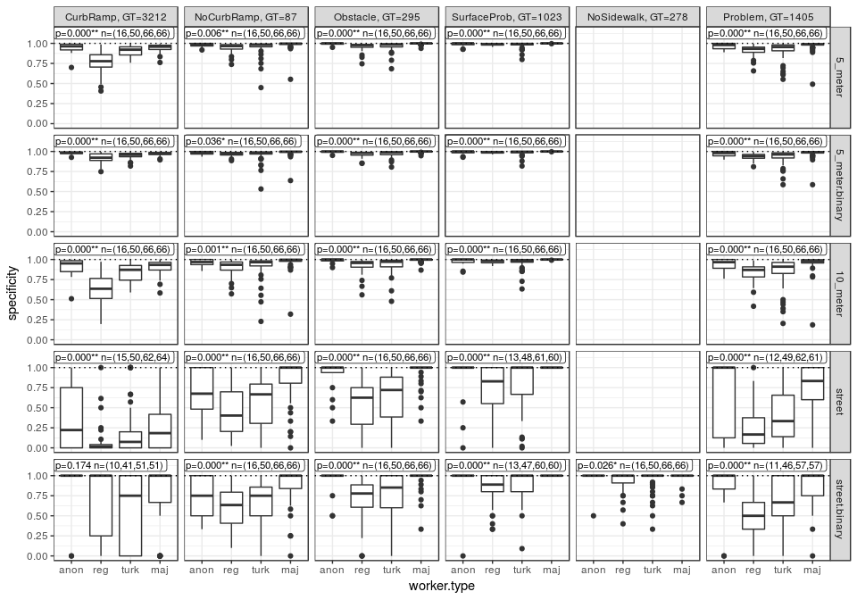

Volunteer Data
--------------

In this section, there are a series of histograms that help to visualize the distribution of volunteers' accuracy. For each accuracy measure, there is a grid of histograms split by label type and granularity (street, 5 meter, 10 meter).

Note that these histograms have lines representing the *mean* of each group (not the *median*; lmk if you want to see median instead).

#### Raw accuracy

Defined as $\\frac{TP + TN}{TP + TN + FP + FN}$. Just the percentage of things they got correct.

#### Recall

Defined as $\\frac{TP}{TP + FN}$. High recall means that they found most of the issues/features.

#### Precision

Defined as $\\frac{TP}{TP + FP}$. High precision means that they rarely placed a label when they shouldn't have.

*Note*: Very little confidence should be given to precision for the NoSidewalk label, since GT labelers only placed the label at intersections and at places where a sidewalk ends.

#### F-measure

Defined as $2 \* \\frac{precision \* recall}{precision + recall}$. It is essentially a balance between recall and precision.

#### Specificity

Defined as $\\frac{TN}{TN + FP}$. Similar to precision, high specificity means that they rarely placed a label when they shouldn't have, but specificity gives more weight to true *negatives*, while precision gives more weight to true *positives*.

Turker Data
-----------

### Comparing effects of number of turkers and vote type on accuracy

In this section, there are a series of line graphs to help visualize how the number of turkers used and the method of voting affects the various accuracy measures. For each accuracy measure, there is a grid of line graphs, split by label type and granularity (same as above). However, each graph also has a line for each of the voting methods. You will notice that all voting methods are equivalent when looking at only one turker.

#### Raw Accuracy

Defined as $\\frac{TP + TN}{TP + TN + FP + FN}$. Just the percentage of things they got correct.

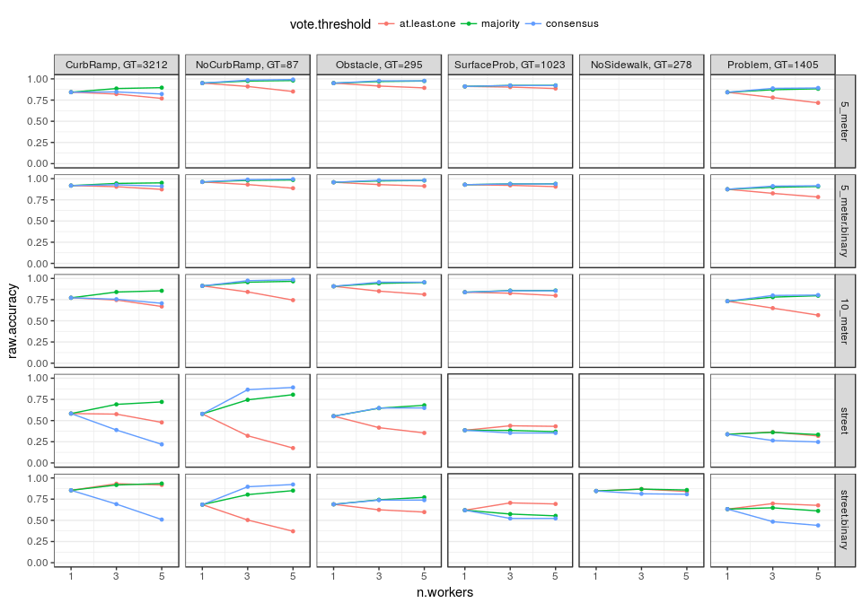

#### Recall

Defined as $\\frac{TP}{TP + FN}$. High recall means that they found most of the issues/features.

#### Precision

Defined as $\\frac{TP}{TP + FP}$. High precision means that they rarely placed a label when they shouldn't have.

#### F-measure

Defined as $2 \* \\frac{precision \* recall}{precision + recall}$. It is essentially a balance between recall and precision.

#### Specificity

Defined as $\\frac{TN}{TN + FP}$. Similar to precision, high specificity means that they rarely placed a label when they shouldn't have, but specificity gives more weight to true *negatives*, while precision gives more weight to true *positives*.

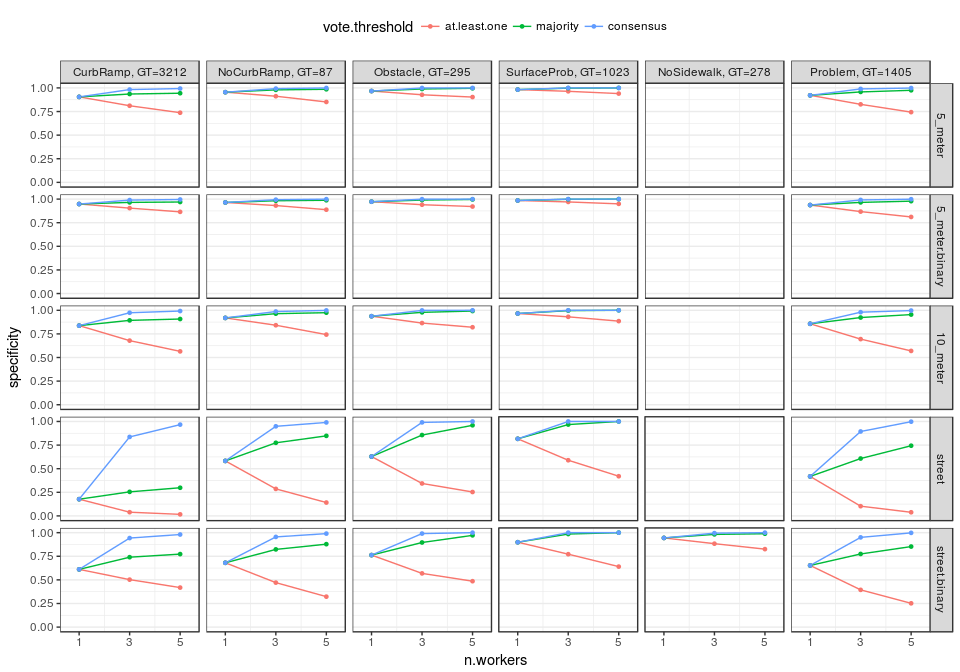

Removing Low Severity
---------------------

In this section, we are looking at how accuracy is effected when we remove low severity labels from the GT set. The idea is that higher severity problems (as defined by the GT labelers) will be easier for crowd workers to find, resulting in higher recall. This would be a nice result to have, to say that crowd workers can at least find the most severe problems. The two expected outcomes here: recall goes up, and for precision to go down. I've included all accuracy types for now in case we see anything interesting.

*Note*: Low severity labels were removed from the *ground truth data only*. This is why we expect precision to go down, as legitimate problems have been removed from the ground truth, that crowd workers may have seen. Removing only crowd worker labels, but not GT labels, would likely result in higher precision and lower recall. Removing labels from both GT and crowd workers would probably result in lower precision *and* recall, due to the variability in how people label severity. Discrepancy between GT and crowd worker severity ratings will be addressed in a separate section.

### How many low severity problems are there?

Below is a graph that shows the number of conditions (sets of routes) containing at least one label (split by label type), and how that is affected by removing low severity labels. On that first graph, the horizontal line shows the number of conditions that is in the current data set (some still need to be added once I fix some bugs and such).

The second graph shows the GT label counts, and how they are affected by removing low severity labels.

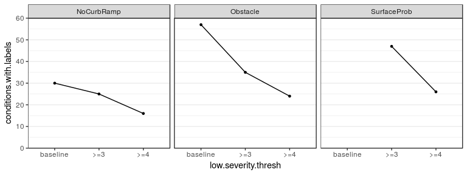

#### Raw Accuracy

Defined as $\\frac{TP + TN}{TP + TN + FP + FN}$. Just the percentage of things they got correct.

#### Recall

Defined as $\\frac{TP}{TP + FN}$. High recall means that they found most of the issues/features.

#### Precision

Defined as $\\frac{TP}{TP + FP}$. High precision means that they rarely placed a label when they shouldn't have.

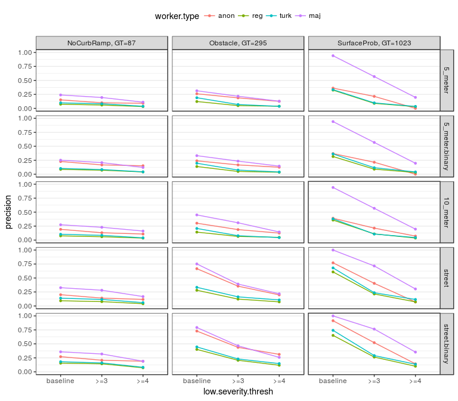

#### F-measure

Defined as $2 \* \\frac{precision \* recall}{precision + recall}$. It is essentially a balance between recall and precision.

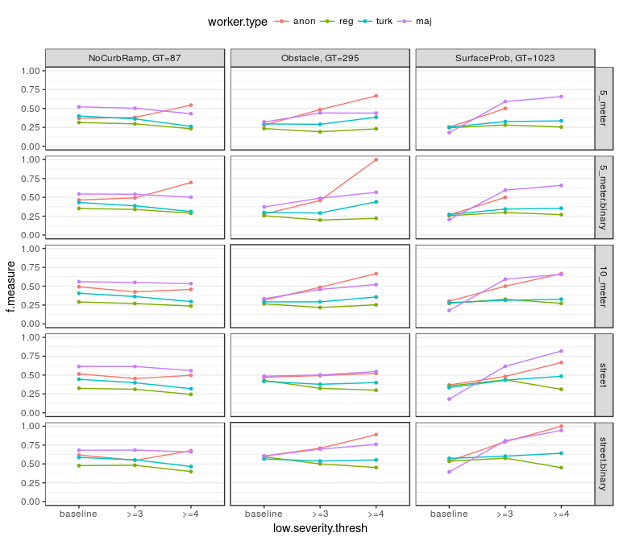

#### Specificity

Defined as $\\frac{TN}{TN + FP}$. Similar to precision, high specificity means that they rarely placed a label when they shouldn't have, but specificity gives more weight to true *negatives*, while precision gives more weight to true *positives*.

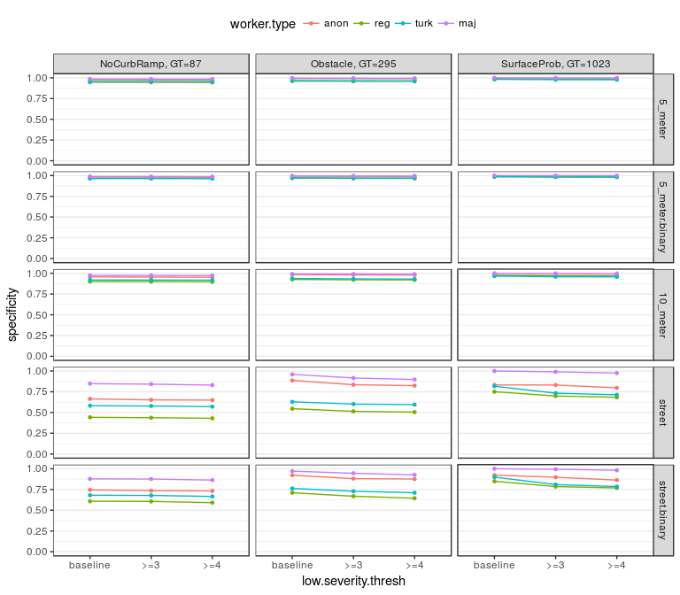

Incorporating single-user clustering
------------------------------------

#### Label counts

*Expected*: There will be *significantly fewer* ramp labels, and *slightly* fewer labels from the other label types: since ramp labels often come in pairs, although a much lower distance threshold is being used for the clustering of ramp labels, we can expect a fair number of legitimate ramp labels to be excluded.

*Observed*: \* The decrease in labels was most pronounced for registered users, followed by turkers, with few anonymous user labels being removed. \* Most of the labels that were removed were actually false positives (good news!). I expect that this is due to situations where there are two nearby problems/features of the same type, and once duplicates from individual users have been removed, the final placement of the clustered labels were more accurate. \* For turkers with majority vote, there was actually an increase in true positives for all label types but Obstacles! \* For individual users, the decreases in CurbRamp, Obstacle, and NoSidewalk labels are more pronounced than for NoCurbRamp or SurfaceProblem labels.

*Expected*: For higher vote thresholds, and for larger numbers of turkers being clustered, the *reduction in labels might be more pronounced*. The rationale is that in both those situations, there are more turkers involved, and thus there is a higher probability that one of the labels in the cluster is removed after single-user clustering... Increasing the probability that said cluster will no longer make the vote threshold.

*Observed*: We actually see the opposite effect; for more turkers and higher vote thresholds, we see fewer "issues" being removed, with no consensus issues being removed whatsoever. This actually makes more sense, since single-user clustering is just removing duplicates from each user, which would still leave a label from each user to be used in majority vote, for example.

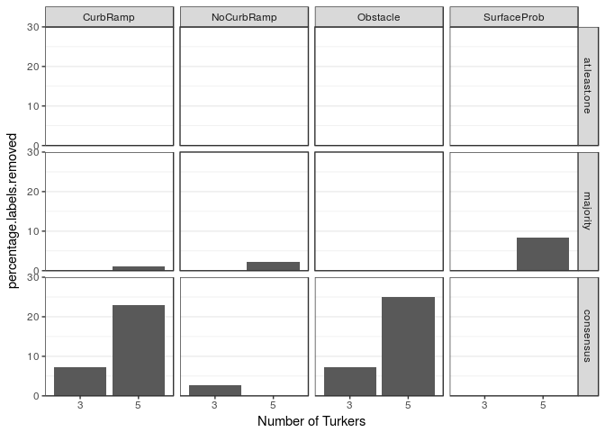

#### Recall

*Expected*: Recall will be *slightly worse* for all non-ramp label types: there are some cases where there are, in fact, multiple distinct issues in close proximity to one another. In such cases, clustering will remove one of the labels from the volunteer's data, thus lowering recall.

Recall with be *significantly worse* for CurbRamp and NoCurbRamp labels: due to there being significantly fewer ramp labels.

*Observed*: At least for individual users, recall does decrease very slightly, and more so for ramp label types. For clustered turkers, in some cases recall decreased slightly, but it also increased slightly for some label types. This can be explained in the same way as when we looked at the label counts. We are just getting rid of duplicate individual labels, and aren't really losing majority vote labels. In some cases, the multi-user clustering may be placing the clustered label in a more appropriate place, which could be the reason for an increase in true positives.

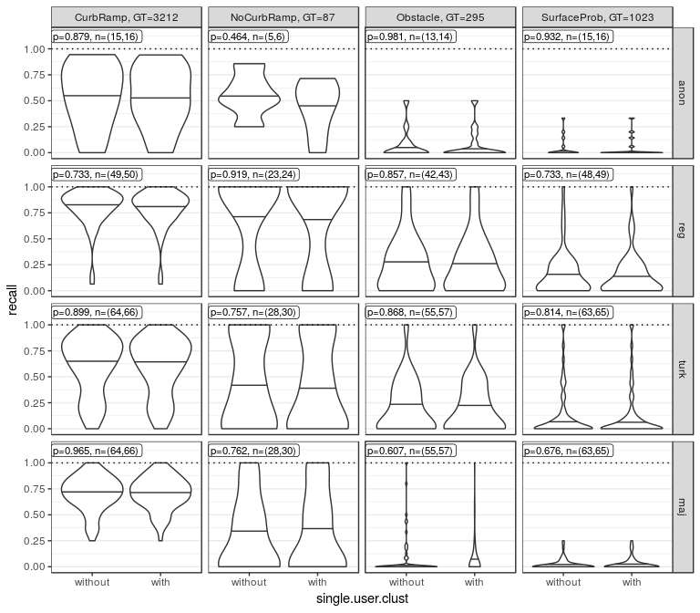

#### Precision

*Expected*: Precision will *improve slightly* for all label types: in situations where a user labeled the same problem/feature multiple times, clustering should remove the duplicate label, thus improving precision.

*Observed*: In almost all cases, we do see a slight improvement in precision. The outliers are CurbRamp labels, which have a sizable improvement in precision (especially for registered users); anonymous users, whose precision does not seem to have been affected; and SurfaceProblem labels for turkers, where precision actually slightly decreased.

#### Specificity

*Expected*: Specificity will *improve slightly* across the board: fewer labels =&gt; more true negatives and fewer false positives =&gt; higher specificity.

*Observed*: It is not exceptionally obvious from the graph, but specificity does improve slightly across the board. There is no way that specificity could get worse, since the formula includes only true negatives and false positives, which can only improve if we take away some labels. The largest improvement is with CurbRamps placed by registered users.

#### Variance in accuracy

*Expected*: Variance will be *slightly larger* for precision and f-measure, for turkers with vote thresholds greater than 1: fewer labels =&gt; fewer labels that pass majority vote =&gt; fewer true/false positives =&gt; more sets of turkers with no true or false positives (for a given label type) =&gt; more sets of turkers with null precision (since denominator is TP + FP), and f-measure (since precision is used to compute f-measure) =&gt; larger confidence intervals for those accuracy types (b/c smaller n).

*Observed*: For the same reasons that my other expected effects for multiple turkers for majority vote or consensus, expectations are not met here either. Since there aren't actually fewer majority vote labels after single users clustering, differences in variance shown below do not reflect the size of `n`. I don't see any clear patterns below.

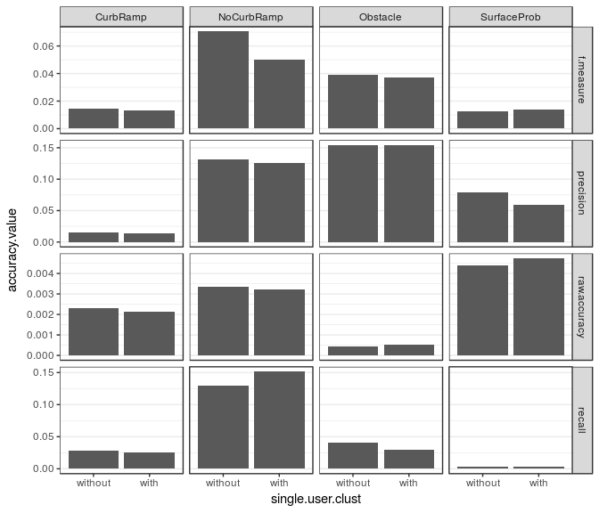
