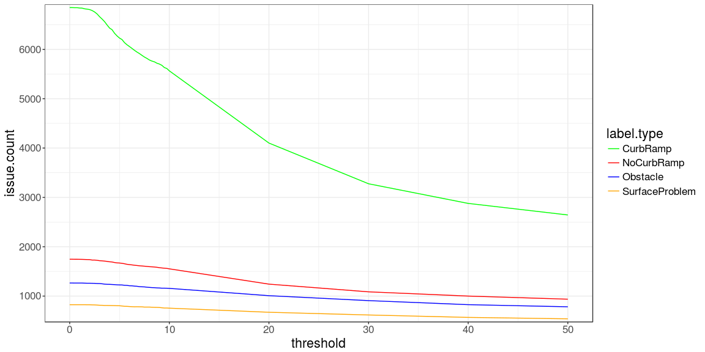
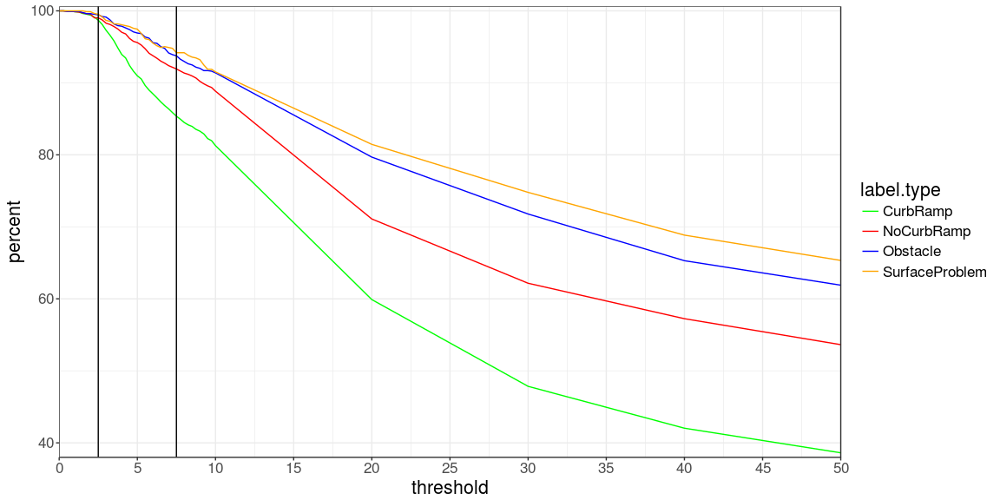
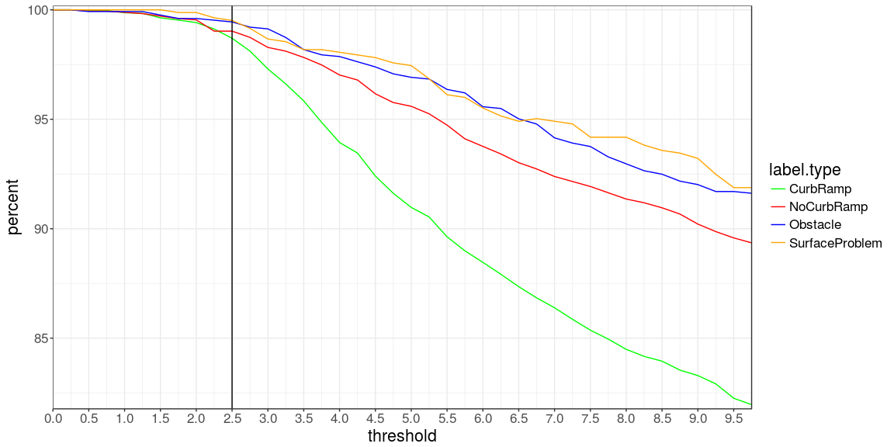
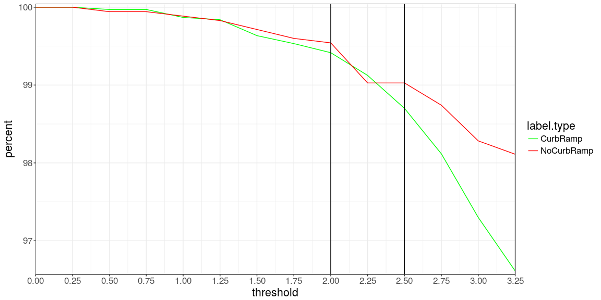
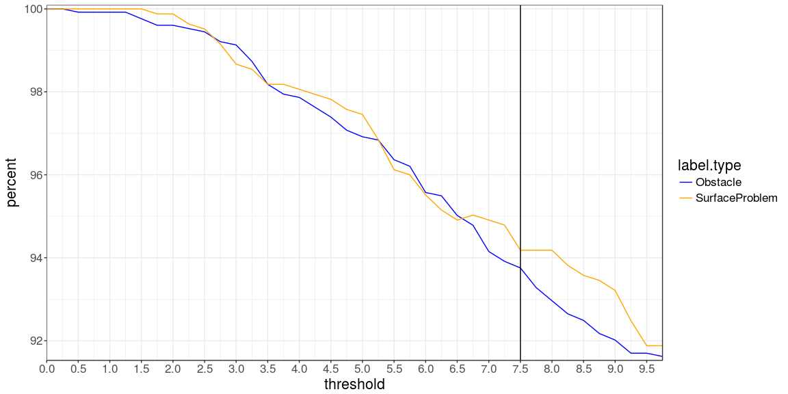
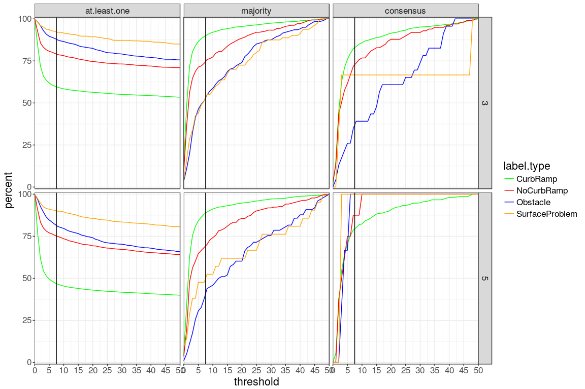

Clustering Threshold Analysis
================
Mikey Saugstad
December 10, 2017

Single-user clustering
----------------------

Multi-user clustering
---------------------

This graph shows the percent of the max number of issues/features of that issue/feature type at varying clustering thresholds. The plots are split by voting procedure and number of turkers, with a line for each label type in each subplot. By "percent of the max...", I mean that within that group (where we grouped by voting procedure, number of turkers, and label type), the max number of issues/features found across all thresholds. I placed a vertical line at 7.5 meters, which is the distance that we have been using as our clustering threshold before this analysis.

For the "at least one" voting procedure, the number of issues/features is monotonically decreasing, and this will always be the case. At a threshold of 0, all the labels are their own issue/feature, then labels get collapsed into clusters as you increase the threshold, reducing the number of issues/features.

For consensus, there are so few agreed upon labels for the SurfaceProblem label type (and also the Obstacle and NoCurbRamp label types, just in the case of 5 turkers), that there isn't much to gain from looking at the graph. We shouldn't be using the consensus graph to help us determine what threshold to use, since we almost certainly won't use that in practice (false positives are much easier to fix than false negatives).

When looking at majority vote, we see that at a threshold of 5 meters, we hit about 80% of the max number of curb ramps, and 70% of the max number of missing curb ramps, with much slower growth after that. For the other label types, we see a steeper slope during the first 5-8 than at higher thresholds, though the slope is definitely steeper at higher thresholds for these label types than for the ramp types.

