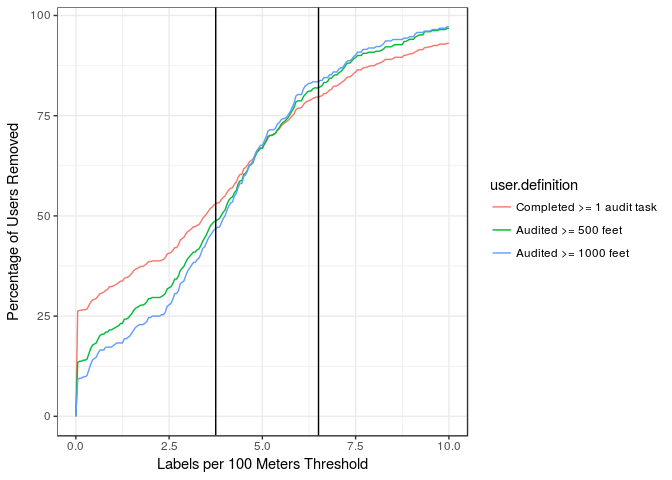

Re-Audit Analysis
================
Mikey Saugstad
January 17, 2018

This graph shows what percentage of DC we would have to re-audit (in terms of distance), given different labels/100 meter thresholds for users. For example at x = 5.0, I looked at what our completion percentage would be if we removed the audits from all users who have a labeling frequency of less than 5 labels per 100 meters. For reference, Mikey's label frequency is 6.5 labels/100m, and Jon's is 10.1 labels/100m. I added lines vertical lines on the graph below for each of us; I also added a line at my recommended cutoff of 3.75 labels/100m.

And here are some summary statistics for the users:

    ## Adding missing grouping variables: `user_id`

    ##    user_id                     role     distance_audited   
    ##  Length:575         Administrator:  6   Min.   :     2.77  
    ##  Class :character   Anonymous    :319   1st Qu.:    83.52  
    ##  Mode  :character   Owner        :  1   Median :   298.46  
    ##                     Researcher   : 16   Mean   :  2343.19  
    ##                     Turker       : 21   3rd Qu.:  1264.50  
    ##                     User         :212   Max.   :186983.03  
    ##   label_count      labels.per.100m 
    ##  Min.   :    0.0   Min.   : 0.000  
    ##  1st Qu.:    0.0   1st Qu.: 0.000  
    ##  Median :    9.0   Median : 3.457  
    ##  Mean   :  111.6   Mean   : 4.088  
    ##  3rd Qu.:   58.0   3rd Qu.: 5.801  
    ##  Max.   :11964.0   Max.   :53.010
