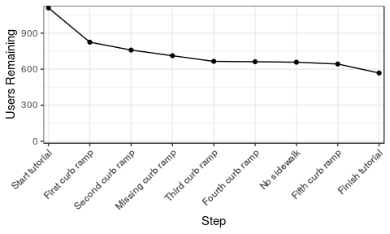
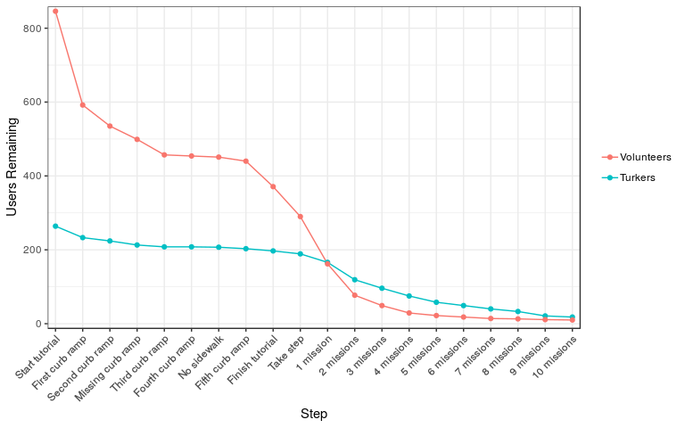
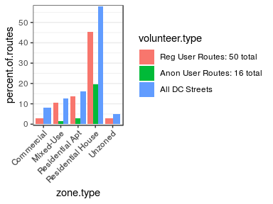
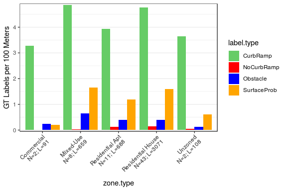
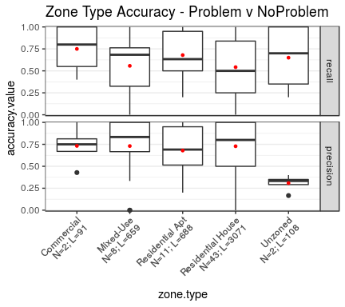
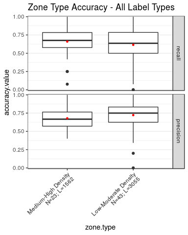
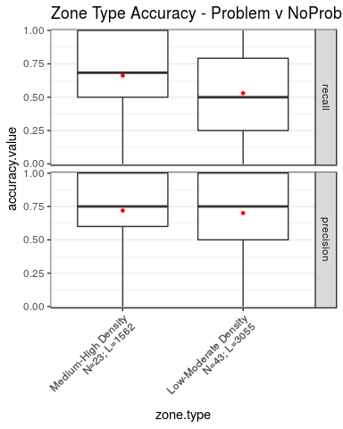
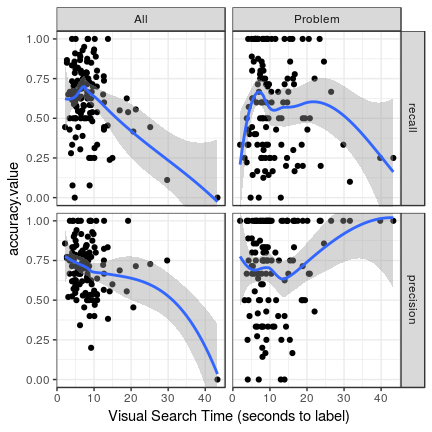

Statistics for Paper
================
Mikey Saugstad
April 17, 2018

-   [Public Deployment](#public-deployment)
    -   [High-level results](#high-level-results)
        -   [Top-line numbers (no filtering)](#top-line-numbers-no-filtering)
        -   [Attribute counts by type](#attribute-counts-by-type)
        -   [Dataset 1st 100% vs full deployment](#dataset-1st-100-vs-full-deployment)
        -   [Data characteristics](#data-characteristics)
        -   [Data lost due to filtering](#data-lost-due-to-filtering)
        -   [User stats and tool usage](#user-stats-and-tool-usage)
    -   [Possible Stories](#possible-stories)
        -   [Data overlap and agreement between users](#data-overlap-and-agreement-between-users)
        -   [Tutorial dropoffs](#tutorial-dropoffs)
        -   [User dropoffs](#user-dropoffs)
-   [Turk Study](#turk-study)
    -   [High level results](#high-level-results-1)
        -   [Ground truth label counts](#ground-truth-label-counts)
        -   [Aggregate accuracy](#aggregate-accuracy)
        -   [Voting: Improved recall when at least one turker marks](#voting-improved-recall-when-at-least-one-turker-marks)
        -   [Descriptive stats for users](#descriptive-stats-for-users)
        -   [IRR](#irr)
    -   [Possible Stories](#possible-stories-1)
        -   [Granularity: Street-level vs 5 meter-level](#granularity-street-level-vs-5-meter-level)
        -   [Accuracy by user group](#accuracy-by-user-group)
        -   [Accuracy by label type](#accuracy-by-label-type)
        -   [Visual search time: Time to label by type](#visual-search-time-time-to-label-by-type)
        -   [Zone type: Land use effect on accuracy](#zone-type-land-use-effect-on-accuracy)
        -   [User behavior: Does auditing speed, etc influence accuracy](#user-behavior-does-auditing-speed-etc-influence-accuracy)
        -   [User group: Reg vs anon vs turk1 vs turk3 vs turk5](#user-group-reg-vs-anon-vs-turk1-vs-turk3-vs-turk5)
        -   [Low severity: Removing low severity effect on recall](#low-severity-removing-low-severity-effect-on-recall)
        -   [Binary vs ordinal issues per segment](#binary-vs-ordinal-issues-per-segment)

Public Deployment
=================

NOTE: Public deployment data includes all data up through March 31st (and part of April 1st). This includes all data through the most recent deployment on mturk. We only consider someone a "user" if they have completed an audit of at least one street and have placed at least one label after the tutorial. Later on, we also filter out users with low labeling frequency.

High-level results
------------------

### Top-line numbers (no filtering)

The following are the label counts (not attribute counts) by user group and label type. There are a total of 251439 labels, 11347 are tutorial labels and 240092 are non tutorial labels. We consider only non tutorial labels throughout this document.

| label\_type    | Anon         | Registered    | Turker         | Researcher    | Total           |
|:---------------|:-------------|:--------------|:---------------|:--------------|:----------------|
| CurbRamp       | 10632 (4.4%) | 27144 (11.3%) | 88554 (36.9%)  | 18336 (7.6%)  | 144666 (60.3%)  |
| NoCurbRamp     | 1310 (0.5%)  | 3250 (1.4%)   | 13262 (5.5%)   | 1138 (0.5%)   | 18960 (7.9%)    |
| Obstacle       | 1105 (0.5%)  | 2827 (1.2%)   | 16154 (6.7%)   | 1498 (0.6%)   | 21584 (9.0%)    |
| SurfaceProblem | 765 (0.3%)   | 1896 (0.8%)   | 3216 (1.3%)    | 2591 (1.1%)   | 8468 (3.5%)     |
| NoSidewalk     | 1414 (0.6%)  | 6211 (2.6%)   | 28181 (11.7%)  | 7919 (3.3%)   | 43725 (18.2%)   |
| Occlusion      | 68 (0.0%)    | 310 (0.1%)    | 462 (0.2%)     | 438 (0.2%)    | 1278 (0.5%)     |
| Other          | 92 (0.0%)    | 148 (0.1%)    | 1137 (0.5%)    | 34 (0.0%)     | 1411 (0.6%)     |
| Total          | 15386 (6.4%) | 41786 (17.4%) | 150966 (62.9%) | 31954 (13.3%) | 240092 (100.0%) |

### Attribute counts by type

Here are the counts of attributes by attribute type after single and multi user clustering.

| attribute.type | count  | percentage |
|:---------------|:-------|:-----------|
| CurbRamp       | 50652  | 49.6%      |
| NoCurbRamp     | 7897   | 7.7%       |
| Obstacle       | 12913  | 12.6%      |
| SurfaceProblem | 5643   | 5.5%       |
| NoSidewalk     | 23159  | 22.7%      |
| Occlusion      | 933    | 0.9%       |
| Other          | 914    | 0.9%       |
| Problem        | 23419  | -          |
| Total          | 102111 | 100.0%     |

### Dataset 1st 100% vs full deployment

The first table describes the dataset at the point where we hit 100% completion. The second table describes the full dataset. Both include *all* users, not just "good" users. We define a user to be someone who both completed an audit of at least one street segment *and* placed at least one label after the tutorial.

| role       | n.users | label\_count | miles\_audited |
|:-----------|:--------|:-------------|:---------------|
| Researcher | 26      | 29107        | 224            |
| Anonymous  | 2551    | 14866        | 199            |
| Turker     | 62      | 78168        | 1223           |
| Registered | 326     | 41537        | 534            |

| role       | n.users | label\_count | miles\_audited |
|:-----------|:--------|:-------------|:---------------|
| Researcher | 29      | 31954        | 240            |
| Anonymous  | 2876    | 15657        | 205            |
| Turker     | 277     | 150966       | 2294           |
| Registered | 355     | 41786        | 538            |

### Data characteristics

This is the start of filtering out users with low labeling frequency (also filtering out researchers).

| CurbRamp | NoCurbRamp | NoSidewalk | Obstacle | Occlusion | Other | SurfaceProblem | Total  |
|:---------|:-----------|:-----------|:---------|:----------|:------|:---------------|:-------|
| 85439    | 8508       | 31927      | 18056    | 685       | 1070  | 4693           | 150378 |

There have been a total of 19559 audits by our "good" users across 13020 streets, averaging 1.5 audits per street. Of the 5061 streets that have been audited multiple times, there are an average of 2.29 audits per street.

### Data lost due to filtering

There were 826 users who placed 240092 labels pre-filtering. Researchers accounted for 28 of the users (3.39%) and 31954 of the labels (13.3%). Non-researchers with low labeling frequency accounted for 195 of the users (23.6%) and 54876 of the labels (22.9%). This means that we filtered out a total of 223 of the users (27%) and 86830 of the labels (36.2%), and are left with 603 of the users (73%) and 150378 of the labels (62.6%).

### User stats and tool usage

TODO: Missions started vs missions completed (not sure we can do this; I expect it to be difficult, without much benefit).

Below are the means/medains/sds for a few metrics (followed by sums), split by user group. For all user groups, the minimum threshold to be included in this list was that they have completed at least one audit task and that their labeling threshold is above 3.75 labels per 100 meters.

NOTE: A "session" below is defined as a sequence of audit task interactions for a user where the minimum time between consecutive interactions is less than one hour.

| role       | n.users | audit\_count\_md | audit\_count\_mn | audit\_count\_sd | km\_md | km\_mn | km\_sd | label\_count\_md | label\_count\_mn | label\_count\_sd | labels\_per\_100m\_md | labels\_per\_100m\_mn | labels\_per\_100m\_sd | miles\_audited\_md | miles\_audited\_mn | miles\_audited\_sd | minutes\_audited\_md | minutes\_audited\_mn | minutes\_audited\_sd | minutes\_per\_session\_md | minutes\_per\_session\_mn | minutes\_per\_session\_sd | mission\_count\_md | mission\_count\_mn | mission\_count\_sd | m\_per\_min\_md | m\_per\_min\_mn | m\_per\_min\_sd | n\_sessions\_md | n\_sessions\_mn | n\_sessions\_sd |
|:-----------|:--------|:-----------------|:-----------------|:-----------------|:-------|:-------|:-------|:-----------------|:-----------------|:-----------------|:----------------------|:----------------------|:----------------------|:-------------------|:-------------------|:-------------------|:---------------------|:---------------------|:---------------------|:--------------------------|:--------------------------|:--------------------------|:-------------------|:-------------------|:-------------------|:----------------|:----------------|:----------------|:----------------|:----------------|:----------------|
| Anonymous  | 293     | 2                | 4.031            | 12.690           | 0.133  | 0.439  | 1.685  | 17.0             | 36.724           | 89.948           | 10.508                | 23.164                | 37.934                | 0.083              | 0.273              | 1.047              | 10.640               | 17.589               | 25.105               | 6.120                     | 9.289                     | 10.913                    | 0                  | 1.078              | 2.554              | 13.660          | 19.980          | 21.169          | 2               | 2.232           | 1.902           |
| Registered | 188     | 8                | 27.505           | 111.245          | 0.869  | 3.352  | 14.658 | 70.5             | 191.080          | 731.413          | 6.800                 | 11.257                | 20.336                | 0.540              | 2.083              | 9.108              | 29.335               | 57.882               | 139.760              | 20.367                    | 28.329                    | 27.346                    | 3                  | 5.553              | 22.634             | 37.314          | 42.404          | 29.573          | 1               | 2.101           | 3.638           |
| Turker     | 122     | 5                | 108.254          | 419.687          | 0.586  | 13.408 | 52.259 | 59.0             | 850.984          | 2961.015         | 8.900                 | 13.962                | 17.996                | 0.364              | 8.331              | 32.472             | 26.940               | 225.221              | 757.025              | 26.370                    | 37.720                    | 34.596                    | 3                  | 24.205             | 87.261             | 23.623          | 30.571          | 25.034          | 1               | 3.082           | 6.756           |

| role       | n.users | audits | hours\_audited | km   | labels | miles | missions | coverage | &gt;1 sess |
|:-----------|:--------|:-------|:---------------|:-----|:-------|:------|:---------|:---------|:-----------|
| Anonymous  | 293     | 1181   | 86             | 129  | 10760  | 80    | 316      | 7.4%     | 72%        |
| Registered | 188     | 5171   | 181            | 630  | 35923  | 392   | 1044     | 36.4%    | 38%        |
| Turker     | 122     | 13207  | 458            | 1636 | 103820 | 1016  | 2953     | 94.5%    | 23%        |

Possible Stories
----------------

### Data overlap and agreement between users

Among all the data collected in DC, how much of DC is labeled by multiple users and what is the disagreement among them? (see comment in Outline document for details on implementation)

A total of 38.9% of streets were audited by multiple users.

### Tutorial dropoffs

Below we look at how users drop off in the tutorial. Because most volunteers going through the tutorial have not yet registered, we simply use IP address as a "user" for the purpose of analyzing the tutorial in particular; however, turkers are automatically logged in immediately, so we use turker id for them. We consider only users who clicked on the "Let's get started!" button on the tutorial page as having started the tutorial. To simplify the analysis, we are looking at only tutorial attempts after the small additions we made to the tutorial last summer (so the data starts July 10th, 2017).

The steps in the graph below are as follows:

1.  Clicked "Let's get started!"
2.  Placed first curb ramp label *and correctly rated severity*
3.  Placed second curb ramp label and correctly rated severity
4.  Placed missing curb ramp label and correctly rated severity
5.  Placed third curb ramp label and correctly rated severity
6.  Placed fourth curb ramp label and correctly rated severity
7.  Placed no sidewalk label
8.  Placed fifth curb ramp label and correctly rated severity
9.  Took step forward and clicked through all dialog boxes to finish tutorial

Of the 1112 people who started the tutorial, 827 finished the first step (74%), and 570 completed the tutorial (51%).

The first graph shows both volunteers and turkers together, and the second shows them split.

### User dropoffs

Below we look at how users drop off after finishing the tutorial. For consistency with the tutorial analysis, we use IP address to denote a volunteer user and turker id to differentiate between turkers (the 570 IP addresses and turker ids who finished the tutorial in the previous section are the same 570 IPs/IDs that we are looking at below). As such, we are looking at only those who finished the tutorial after July 10th, 2017.

We also only counted missions completed in the two hours after finishing the tutorial. There was not a sizeable difference when looking at 1 hour, 2 hours, or 48 hours after finishing the tutorial, so I think that 2 hours works fine.

The steps in the graph below are as follows:

1.  Finished tutorial
2.  Took a step
3.  Completed first mission
4.  Completed second mission
5.  And so on...

Of the 570 people who finished the tutorial, 480 took a step (84%), 329 finished at least one mission afterwards (58%), 197 completed at least two missions afterwards (35%), and 28 did at least 10 missions afterwards (5%).

The first graph shows both volunteers and turkers together, and the second shows them split.

Turk Study
==========

Update: This is now all of the data. There used to be 19 anonymous user routes, but three of them actually had no labels placed by the anonymous user (we had forgotten to check beforehand), thus we have only 16.

Even though 5 turkers did each route, the high level results for individual turkers looks only at the first turker to complete each set of routes. This makes aggregate stats more even, and a fairer comparison across user groups. (but maybe we should actually use all turkers when not aggregating, actually...)

High level results
------------------

### Ground truth label counts

Below is a table showing number of ground truth labels by user group and by label type.

| worker.type | All    | Problem | CurbRamp | NoCurbRamp | Obstacle | SurfaceProb |
|:------------|:-------|:--------|:---------|:-----------|:---------|:------------|
| anon        | 775    | 297     | 478      | 19         | 59       | 219         |
| reg         | 3842   | 1108    | 2734     | 68         | 236      | 804         |
| total       | 4617   | 1405    | 3212     | 87         | 295      | 1023        |
| % of total  | 100.0% | 30.4%   | 69.6%    | 1.9%       | 6.4%     | 22.2%       |

A total of 330 turkers, 50 registered users, and 16 anonymous users were part of this study.

### Aggregate accuracy

Below are two tables (street level, then 5 meter level) showing mean accuracy across all users when aggregating over all label types, and for problem vs no problem. We see that the All/Problem accuracies are comparable at the street level, but accuracy is much higher for curb ramps than problems at the 5 meter level (which makes Problem have a much lower accuracy than All).

NOTE: In these two tables, the data is binary (not ordinal), we are only considering single users auditing (i.e., no multi-user clustering or majority vote), and we only consider the first turker to audit each route.

Mean accuracy across all users - street level:

| label.type | recall | precision | f.measure |
|:-----------|:-------|:----------|:----------|
| All        | 0.631  | 0.707     | 0.647     |
| Problem    | 0.577  | 0.707     | 0.602     |

Mean accuracy across all users - 5 meter level:

| label.type | recall | precision | f.measure |
|:-----------|:-------|:----------|:----------|
| All        | 0.445  | 0.490     | 0.445     |
| Problem    | 0.181  | 0.285     | 0.223     |

### Voting: Improved recall when at least one turker marks

Since dealing with false positives is pretty easy (relative to walking through GSV), the most important thing for us is to maximize recall. So how does recall look if we consider a label placed by at least one turker as a potential attribute (i.e., we use the "at least one" voting method)?

For reference, individual turkers tended to have the best performance among our user groups, and their recall for problem vs no problem was 0.66 and their precision was 0.71.

NOTE: In this section we are looking at *problem vs no problem*, the data are binary (not ordinal), the data are at the street level (not 5 meter level), and we are looking at 5 clustered turkers with the "at least one" voting method.

*Takeaways*:

-   The mean recall improves significantly when going from majority vote to the "at least one" voting method, accompanied by a much smaller decrease in precision. Since recall is much more important to us, this is the voting method we should likely use going forward.

| voting.method | recall | precision |
|:--------------|:-------|:----------|
| majority.vote | 0.425  | 0.819     |
| at.least.one  | 0.962  | 0.643     |

### Descriptive stats for users

Next we have some descriptive statistics of users, by user group. These are average (mean/median) stats.

NOTE: In this table, we are only considering single users auditing (i.e., no multi-user clustering or majority vote), and we only consider the first turker to audit each route.

| worker.type | n.users | labels.per.100m\_md | labels.per.100m\_mn | labels.per.100m\_sd | minutes\_audited\_md | minutes\_audited\_mn | minutes\_audited\_sd | m.p.min\_md | m.p.min\_mn | m.p.min\_sd | sec.p.label\_md | sec.p.label\_mn | sec.p.label\_sd |
|:------------|:--------|:--------------------|:--------------------|:--------------------|:---------------------|:---------------------|:---------------------|:------------|:------------|:------------|:----------------|:----------------|:----------------|
| anon        | 16      | 4.921               | 5.116               | 3.382               | 12.865               | 14.332               | 6.327                | 47.429      | 55.232      | 38.167      | 6.939           | 10.446          | 10.058          |
| reg         | 50      | 5.988               | 6.063               | 3.457               | 23.660               | 26.226               | 13.297               | 51.583      | 58.561      | 30.531      | 5.232           | 5.943           | 2.522           |
| turk1       | 66      | 7.669               | 8.320               | 4.109               | 33.695               | 37.717               | 16.108               | 30.825      | 31.597      | 11.112      | 8.416           | 9.599           | 4.560           |

Below, we have a table of aggregate (sum) stats by user group.

NOTE: In this table, we are only considering single users auditing (i.e., no multi-user clustering or majority vote), and we only consider the first turker to audit each route.

| worker.type | n.users | distance.km | distance.miles | hours.audited | n.labels | n.missions |
|:------------|:--------|:------------|:---------------|:--------------|:---------|:-----------|
| anon        | 16      | 9.754       | 6.061          | 3.822         | 499      | 32         |
| reg         | 50      | 60.960      | 37.879         | 21.855        | 3696     | 150        |
| turk1       | 66      | 70.714      | 43.939         | 41.489        | 5711     | 182        |

### IRR

Our average (mean) IRR over the 7 rounds, by label type, is in the table below:

NOTE: In this table, the data is binary (not ordinal), and is at the street level (not 5 meter level).

| label.type  | mean.kripp.alpha |
|:------------|:-----------------|
| CurbRamp    | 0.907            |
| NoCurbRamp  | 0.787            |
| Obstacle    | 0.342            |
| SurfaceProb | 0.477            |
| Problem     | 0.475            |

Possible Stories
----------------

### Granularity: Street-level vs 5 meter-level

Below we compare street vs 5 meter level recall and precision by label type.

NOTE: In this section, the data is binary (not ordinal), we are only considering single users auditing (i.e., no multi-user clustering or majority vote), and we only consider the first turker to audit each route.

Below is a table showing label type accuracy at the two granularity levels, followed by a graph that gives a visual representation of the mean and standard error.

| accuracy.type | label.type  | granularity | mean.accuracy | median.accuracy | sd    | se    |
|:--------------|:------------|:------------|:--------------|:----------------|:------|:------|
| recall        | All         | street      | 0.631         | 0.651           | 0.216 | 0.019 |
| recall        | All         | 5\_meter    | 0.445         | 0.466           | 0.226 | 0.020 |
| recall        | Problem     | street      | 0.577         | 0.600           | 0.312 | 0.027 |
| recall        | Problem     | 5\_meter    | 0.181         | 0.131           | 0.175 | 0.015 |
| recall        | CurbRamp    | street      | 0.860         | 1.000           | 0.257 | 0.022 |
| recall        | CurbRamp    | 5\_meter    | 0.645         | 0.722           | 0.272 | 0.024 |
| recall        | NoCurbRamp  | street      | 0.693         | 1.000           | 0.435 | 0.056 |
| recall        | NoCurbRamp  | 5\_meter    | 0.498         | 0.500           | 0.441 | 0.057 |
| recall        | Obstacle    | street      | 0.399         | 0.450           | 0.369 | 0.035 |
| recall        | Obstacle    | 5\_meter    | 0.161         | 0.000           | 0.228 | 0.021 |
| recall        | SurfaceProb | street      | 0.271         | 0.200           | 0.305 | 0.027 |
| recall        | SurfaceProb | 5\_meter    | 0.096         | 0.000           | 0.193 | 0.017 |
| precision     | All         | street      | 0.707         | 0.714           | 0.172 | 0.015 |
| precision     | All         | 5\_meter    | 0.490         | 0.500           | 0.199 | 0.017 |
| precision     | Problem     | street      | 0.707         | 0.750           | 0.286 | 0.025 |
| precision     | Problem     | 5\_meter    | 0.285         | 0.250           | 0.258 | 0.023 |
| precision     | CurbRamp    | street      | 0.954         | 1.000           | 0.075 | 0.007 |
| precision     | CurbRamp    | 5\_meter    | 0.646         | 0.684           | 0.218 | 0.019 |
| precision     | NoCurbRamp  | street      | 0.205         | 0.000           | 0.317 | 0.030 |
| precision     | NoCurbRamp  | 5\_meter    | 0.135         | 0.000           | 0.271 | 0.026 |
| precision     | Obstacle    | street      | 0.475         | 0.500           | 0.374 | 0.038 |
| precision     | Obstacle    | 5\_meter    | 0.182         | 0.091           | 0.235 | 0.024 |
| precision     | SurfaceProb | street      | 0.726         | 1.000           | 0.354 | 0.039 |
| precision     | SurfaceProb | 5\_meter    | 0.342         | 0.250           | 0.354 | 0.039 |

*Takeaways*:

-   Analyzing at the 5 meter level shows higher raw accuracy and specificity, both because of the large number of true negatives that we get from splitting into 5 meter segments; there are very few street segments with no labels at all.

-   Analyzing at the street level shows higher recall, implying that there were relatively fewer false negatives at the street level. This may mean that users aren't finding *every* issue, but they are more likely to find *at least one* issue of that type when there are multiple that occur on the same street.

-   Analyzing at the street level shows higher precision, implying that there were relatively fewer false positives at the street level. I suspect that this is due to fundamental misunderstandings about how to label (implying both that labeling is complex and difficult and that our onboarding is insufficient) which are persistent/consistent and frequent (think: labeling driveways as curb ramps, labeling storm drains as missing curb ramps, and labeling fire hydrants or street signs that are not in the way as obstacles). In those cases where the mistake is made frequently (multiple times per street), relatively fewer false positives makes sense when moving to street level analysis.

-   Analyzing at the street level shows higher f-measure. This clearly comes from the higher recall and precision.

-   CurbRamp pretty much outperforms all other label types across the board, regardless of accuracy type of 5 meter vs. street level. This is likely because curb ramps are the easiest label type to understand and find in GSV (both because they are large and easy to see, and because you know where to expect them -- at intersections).

-   The SurfaceProblem label type seems to have the highest precision and lowest recall among the different types of issues (I'm excluding CurbRamp here). I guess that, relative to the other types of issues, there are just fewer cases of mistaking something of a surface problem and more cases of not finding a surface problem that was visible in GSV (so maybe surface problems require increased diligence from users, and the other issues require better treatment in onboarding).

-   The Problem type seems to perform better than the surface problem and obstacle label types (except for surface problem precision, mentioned in the previous bullet).

-   NoCurbRamp seems to have high recall and low precision. This fits my intuition; since users know to expect curb ramps at intersections, if they arrive at an intersection and a curb ramp is not there, they know to place a NoCurbRamp label. However, if there was no sidewalk at all, then we did not add the missing curb ramp labels to the ground truth dataset, and this is not something that we covered during onboarding. I suspect that this, paired with users marking storm drains as missing curb ramps, were the main reasons for the low recall. Both could be addressed through proper training.

### Accuracy by user group

NOTE: In these two tables, the data is binary (not ordinal) and these are mean/median accuracies aggregated across all label types (all.\*) and for the problem vs no problem type (prob.\*).

#### Summary stats

Mean/median/sd accuracy by user group - street level:

| user.type | all.rec.mn | all.rec.md | all.rec.sd | all.prec.mn | all.prec.md | all.prec.sd | all.f.mn | all.f.md | all.f.sd | prob.rec.mn | prob.rec.md | prob.rec.sd | prob.prec.mn | prob.prec.md | prob.prec.sd | prob.f.mn | prob.f.md | prob.f.sd |
|:----------|:-----------|:-----------|:-----------|:------------|:------------|:------------|:---------|:---------|:---------|:------------|:------------|:------------|:-------------|:-------------|:-------------|:----------|:----------|:----------|
| anon      | 0.488      | 0.523      | 0.242      | 0.745       | 0.833       | 0.293       | 0.642    | 0.686    | 0.156    | 0.394       | 0.250       | 0.346       | 0.879        | 1.000        | 0.214        | 0.551     | 0.500     | 0.240     |
| reg       | 0.614      | 0.651      | 0.215      | 0.722       | 0.728       | 0.131       | 0.635    | 0.677    | 0.161    | 0.529       | 0.500       | 0.293       | 0.661        | 0.714        | 0.289        | 0.560     | 0.571     | 0.221     |
| turk1     | 0.678      | 0.707      | 0.194      | 0.688       | 0.700       | 0.164       | 0.658    | 0.648    | 0.140    | 0.658       | 0.700       | 0.294       | 0.708        | 0.750        | 0.288        | 0.644     | 0.667     | 0.233     |
| turk3     | 0.621      | 0.620      | 0.153      | 0.810       | 0.815       | 0.155       | 0.686    | 0.700    | 0.112    | 0.554       | 0.571       | 0.303       | 0.762        | 0.800        | 0.287        | 0.641     | 0.667     | 0.206     |
| turk5     | 0.595      | 0.571      | 0.140      | 0.874       | 0.913       | 0.139       | 0.695    | 0.698    | 0.110    | 0.425       | 0.375       | 0.270       | 0.819        | 1.000        | 0.237        | 0.558     | 0.500     | 0.202     |

Mean/median/sd accuracy by user group - 5 meter level:

| user.type | all.rec.mn | all.rec.md | all.rec.sd | all.prec.mn | all.prec.md | all.prec.sd | all.f.mn | all.f.md | all.f.sd | prob.rec.mn | prob.rec.md | prob.rec.sd | prob.prec.mn | prob.prec.md | prob.prec.sd | prob.f.mn | prob.f.md | prob.f.sd |
|:----------|:-----------|:-----------|:-----------|:------------|:------------|:------------|:---------|:---------|:---------|:------------|:------------|:------------|:-------------|:-------------|:-------------|:----------|:----------|:----------|
| anon      | 0.375      | 0.415      | 0.262      | 0.587       | 0.680       | 0.277       | 0.491    | 0.568    | 0.229    | 0.104       | 0.079       | 0.099       | 0.514        | 0.500        | 0.377        | 0.192     | 0.156     | 0.109     |
| reg       | 0.421      | 0.430      | 0.203      | 0.493       | 0.525       | 0.192       | 0.434    | 0.455    | 0.167    | 0.137       | 0.125       | 0.136       | 0.225        | 0.200        | 0.199        | 0.214     | 0.186     | 0.101     |
| turk1     | 0.481      | 0.490      | 0.231      | 0.466       | 0.489       | 0.180       | 0.443    | 0.471    | 0.179    | 0.232       | 0.200       | 0.200       | 0.285        | 0.272        | 0.248        | 0.235     | 0.211     | 0.135     |
| turk3     | 0.502      | 0.509      | 0.195      | 0.646       | 0.667       | 0.177       | 0.541    | 0.559    | 0.161    | 0.148       | 0.125       | 0.134       | 0.311        | 0.333        | 0.255        | 0.225     | 0.203     | 0.116     |
| turk5     | 0.507      | 0.504      | 0.172      | 0.714       | 0.756       | 0.176       | 0.575    | 0.584    | 0.151    | 0.108       | 0.091       | 0.106       | 0.423        | 0.333        | 0.333        | 0.205     | 0.167     | 0.115     |

#### Statistical significance

NOTE: This is at the street level (not 5 meter level).

We created binomial mixed effects models to determine the relationship between user group and recall/precision. We had user group as the fixed effect and route id as the random effect. We modeled recall/precision as binomial and used a logistic link function.

Using likelihood ratio tests (LRTs), we found the contribution of the fixed effect (worker type) to have a statistically significant association with both recall and precision for both the Problem type and all label types aggregated (results shown below).

To test that the orderings of the user groups are statistically significant (e.g., that turk1 recall is significantly lower than registered user recall for the Problem type, etc), we do post-hoc Tukey's HSD tests. This essentially gives us a pairwise test between each user group, which lets us determine what parts of the ordering are significant. The results of which are shown in the tables below.

NOTE: `*` means less than 0.05, `**` means less than 0.01, and `***` means less than 0.001

NOTE: In places where one user group's accuracy was not statistically different from the one with the closest accuracy to it, I also am showing comparisons to user groups with larger differences in accuracy.

Recall, all label types: likelihood ratio = 23.057, df = 4, n = 264, p &lt; 0.001.

| worker.type | test       | p.value    | z.value | recall |
|:------------|:-----------|:-----------|:--------|:-------|
| turk1       | -          | -          | -       | 0.678  |
| turk3       | &lt; turk1 | 0.056      | 2.6493  | 0.621  |
| reg         | &lt; turk3 | 1.000      | 0.5899  | 0.614  |
| reg         | &lt; turk1 | 0.017 \*   | 3.0746  | 0.614  |
| turk5       | &lt; reg   | 1.000      | 0.3255  | 0.595  |
| turk5       | &lt; turk3 | 0.986      | 0.9770  | 0.595  |
| turk5       | &lt; turk1 | 0.003 \*\* | 3.6205  | 0.595  |
| anon        | &lt; turk5 | 0.283      | 1.8226  | 0.488  |
| anon        | &lt; reg   | 0.283      | 1.9071  | 0.488  |
| anon        | &lt; turk3 | 0.119      | 2.3305  | 0.488  |
| anon        | &lt; turk1 | 0.002 \*\* | 3.7237  | 0.488  |

Precision, all label types: likelihood ratio = 108.36, df = 4, n = 263, p &lt; 0.001

| worker.type | test       | p.value           | z.value | precision |
|:------------|:-----------|:------------------|:--------|:----------|
| turk5       | -          | -                 | -       | 0.874     |
| turk3       | &lt; turk5 | 0.001 \*\*        | 3.7143  | 0.810     |
| anon        | &lt; turk3 | 0.612             | 0.7921  | 0.745     |
| anon        | &lt; turk5 | 0.029 \*          | 2.7554  | 0.745     |
| reg         | &lt; anon  | 0.612             | 1.0234  | 0.722     |
| reg         | &lt; turk3 | &lt; 0.001 \*\*\* | 3.8108  | 0.722     |
| turk1       | &lt; reg   | 0.253             | 1.7959  | 0.688     |
| turk1       | &lt; anon  | 0.253             | 1.8573  | 0.688     |
| turk1       | &lt; turk3 | &lt; 0.001 \*\*\* | 6.0213  | 0.688     |

Recall, Problem type: likelihood ratio = 47.022, df = 4, n = 260, p &lt; 0.001

| worker.type | test       | p.value    | z.value | recall |
|:------------|:-----------|:-----------|:--------|:-------|
| turk1       | -          | -          | -       | 0.658  |
| turk3       | &lt; reg   | 0.481      | 1.120   | 0.554  |
| turk3       | &lt; turk1 | 0.006 \*\* | 3.355   | 0.554  |
| reg         | &lt; turk1 | 0.123      | 2.043   | 0.529  |
| turk5       | &lt; reg   | 0.002 \*\* | 3.684   | 0.425  |
| anon        | &lt; turk5 | 0.481      | 1.174   | 0.394  |
| anon        | &lt; reg   | 0.012 \*   | 3.082   | 0.394  |

Precision, Problem type: likelihood ratio = 8.3102, df = 4, n = 252, p = 0.081

NOTE: Although anon user have a higher average problem type precision than turk5, the model actually says that turk5 has higher precision (though it is not statistically significant). This is because there is just higher precision across the board on the anon user routes; the mixed effects model takes this into account! More on this below.

| worker.type | test       | p.value | z.value | precision |
|:------------|:-----------|:--------|:--------|:----------|
| turk5       | -          | -       | -       | 0.819     |
| anon        | &lt; turk3 | 1.000   | 0.19702 | 0.879     |
| anon        | &lt; turk5 | 1.000   | 0.66753 | 0.879     |
| turk3       | &lt; turk5 | 1.000   | 0.98643 | 0.762     |
| turk1       | &lt; turk3 | 0.865   | 1.60644 | 0.708     |
| turk1       | &lt; anon  | 1.000   | 0.45078 | 0.708     |
| turk1       | &lt; turk5 | 0.143   | 2.45078 | 0.708     |
| reg         | &lt; turk1 | 1.000   | 0.07277 | 0.661     |
| reg         | &lt; turk3 | 0.897   | 1.52165 | 0.661     |
| reg         | &lt; anon  | 1.000   | 0.46253 | 0.661     |
| reg         | &lt; turk5 | 0.175   | 2.33597 | 0.661     |

One interesting thing I am seeing is anon users have a much higher average precision for the Problem type than other user groups, but the difference is not statistically significant. It turns out that on routes audited by anonymous users, turkers *also* had much higher Problem type precision than for registered user routes. This can be seen in the following table:

| worker.type | problem.precision.on.anon.routes |
|:------------|:---------------------------------|
| anon        | 0.879                            |
| turk1       | 0.862                            |
| turk3       | 0.894                            |
| turk5       | 0.922                            |

### Accuracy by label type

NOTE: In the two tables below, the data are binary (not ordinal), we are only considering single users auditing (i.e., no multi-user clustering or majority vote), and we only consider the first turker to audit each route.

#### Summary stats

Mean/median/sd accuracy by label type - street level:

| label.type  | f\_md | f\_mn | f\_sd | prec\_md | prec\_mn | prec\_sd | recall\_md | recall\_mn | recall\_sd |
|:------------|:------|:------|:------|:---------|:---------|:---------|:-----------|:-----------|:-----------|
| All         | 0.667 | 0.647 | 0.149 | 0.714    | 0.707    | 0.172    | 0.651      | 0.631      | 0.216      |
| Problem     | 0.600 | 0.602 | 0.231 | 0.750    | 0.707    | 0.286    | 0.600      | 0.577      | 0.312      |
| CurbRamp    | 0.952 | 0.892 | 0.177 | 1.000    | 0.954    | 0.075    | 1.000      | 0.860      | 0.257      |
| NoCurbRamp  | 0.500 | 0.587 | 0.256 | 0.000    | 0.205    | 0.317    | 1.000      | 0.693      | 0.435      |
| Obstacle    | 0.500 | 0.564 | 0.190 | 0.500    | 0.475    | 0.374    | 0.450      | 0.399      | 0.369      |
| SurfaceProb | 0.500 | 0.531 | 0.209 | 1.000    | 0.726    | 0.354    | 0.200      | 0.271      | 0.305      |
| NoSidewalk  | 0.667 | 0.729 | 0.198 | 1.000    | 0.739    | 0.356    | 0.500      | 0.474      | 0.412      |

Mean/median/sd accuracy by label type - 5 meter level:

| label.type  | f\_md | f\_mn | f\_sd | prec\_md | prec\_mn | prec\_sd | recall\_md | recall\_mn | recall\_sd |
|:------------|:------|:------|:------|:---------|:---------|:---------|:-----------|:-----------|:-----------|
| All         | 0.463 | 0.445 | 0.180 | 0.500    | 0.490    | 0.199    | 0.466      | 0.445      | 0.226      |
| Problem     | 0.200 | 0.223 | 0.121 | 0.250    | 0.285    | 0.258    | 0.131      | 0.181      | 0.175      |
| CurbRamp    | 0.667 | 0.627 | 0.204 | 0.684    | 0.646    | 0.218    | 0.722      | 0.645      | 0.272      |
| NoCurbRamp  | 0.400 | 0.463 | 0.288 | 0.000    | 0.135    | 0.271    | 0.500      | 0.498      | 0.441      |
| Obstacle    | 0.250 | 0.275 | 0.131 | 0.091    | 0.182    | 0.235    | 0.000      | 0.161      | 0.228      |
| SurfaceProb | 0.182 | 0.258 | 0.210 | 0.250    | 0.342    | 0.354    | 0.000      | 0.096      | 0.193      |

#### Statistical significance

NOTE: This is at the street level (not 5 meter level).

We created binomial mixed effects models to determine the relationship between label type and recall/precision. We had label type as the fixed effect and user id nested in route id as random effects. We modeled recall/precision as binomial and used a logistic link function.

Using likelihood ratio tests (LRTs), we found the contribution of the fixed effect (label type) to have a statistically significant association with recall (likelihood ratio = 750.31, df = 3, n = 436, p &lt; 0.001). We also found label type to have a statistically significant association with precision (likelihood ratio = 874.12, df = 3, n = 423, p &lt; 0.001).

To test that the ordering of the label types are statistically significant (e.g., that NoCurbRamp recall is significantly lower than CurbRamp recall, etc), we do post-hoc Tukey's HSD tests. This essentially gives us a pairwise test between each label type, which lets us determine what parts of the ordering are significant. The results of which are shown in a tables below (first recall, then precision).

NOTE: `*` means less than 0.05, `**` means less than 0.01, and `***` means less than 0.001

| label.type  | test            | p.value           | z.value | recall |
|:------------|:----------------|:------------------|:--------|:-------|
| CurbRamp    | -               | -                 | -       | 0.860  |
| NoCurbRamp  | &lt; CurbRamp   | &lt; 0.001 \*\*\* | 4.171   | 0.693  |
| Obstacle    | &lt; NoCurbRamp | &lt; 0.001 \*\*\* | 5.419   | 0.399  |
| SurfaceProb | &lt; Obstacle   | &lt; 0.001 \*\*\* | 5.234   | 0.271  |

| label.type  | test             | p.value           | z.value | precision |
|:------------|:-----------------|:------------------|:--------|:----------|
| CurbRamp    | -                | -                 | -       | 0.954     |
| SurfaceProb | &lt; CurbRamp    | &lt; 0.001 \*\*\* | 10.621  | 0.726     |
| Obstacle    | &lt; SurfaceProb | &lt; 0.001 \*\*\* | 4.615   | 0.475     |
| NoCurbRamp  | &lt; Obstacle    | &lt; 0.001 \*\*\* | 7.116   | 0.205     |

### Visual search time: Time to label by type

NOTE: In this section, the data are binary (not ordinal), and is at the street level (not 5 meter level), we are only considering single users auditing (i.e., no multi-user clustering or majority vote), and we only consider the first turker to audit each route.

NOTE: We believe that a user's "typical" visual search time is more accurately represented by their median visual search time than mean due to the long right tail of the distribution of search times.

Below is a table that shows the average time to place a label by label type along with the average recall and precision. The results match my intuition for the most part: CurbRamp has the shortest labeling time, SurfaceProblem has the longest labeling time, and NoCurbRamp and Obstacle are somewhere in between. However, I do find it a bit surprising that NoCurbRamp took longer to label than Obstacle.

Time to place a label is defined as follows:

-   For the first label a user places on a specific panorama, the time that elapsed between stepping into the panorama and placing the label.
-   For subsequent labels on the same panorama, the time that elapsed between placing the previous label and placing the current label.

| label.type  | median.s.to.label | mean.sec.to.label | sd.s.to.label | mean\_recall | mean\_precision |
|:------------|:------------------|:------------------|:--------------|:-------------|:----------------|
| CurbRamp    | 6.89              | 8.14              | 5.29          | 0.86         | 0.95            |
| Obstacle    | 8.21              | 10.10             | 7.54          | 0.40         | 0.47            |
| NoCurbRamp  | 9.46              | 12.78             | 10.20         | 0.69         | 0.20            |
| SurfaceProb | 10.92             | 13.77             | 8.41          | 0.27         | 0.73            |

Now we want to check if label types have a statistically significant difference in visual search time. We also want to see if this ordering is statistically significant. We would normally do an ANOVA followed by Tukey's HSD post-hoc analysis to see if ordering is significant. Since each user's labeling time is recorded *for each label type*, our next idea would be to run a Repeated Measures ANOVA.

However, rANOVA would require us to throw out data for any user who did not place a label of each label type. We have 130 users with labeling time values for curb ramps, but only 119 users have data for surface problems. This would mean throwing away a large amount of data, giving us less power and possibly biasing the results. Thus, we turn to our next option: linear mixed-effect models.

Another reason for using a linear mixed-effect model is because we want to take into account the differences between users, the differences between routes, and the fact that the user factor is nested in the route factor (each user appears in only one route).

For some background on linear mixed-effect models, the reference I found most helpful was this one: <https://stats.idre.ucla.edu/other/mult-pkg/introduction-to-linear-mixed-models/>.

*The Model*: To determine the association between visual search time and label type, we use a linear mixed-effects model where our outcome variable is visual search time, we have label type as a fixed effect, and we have user id nested in route id as random effects. We model the random effects as intercepts, meaning that we assume different baseline visual search times for each user and route, but expect the differences in visual search times between label types to be similar across users/routes.

*The Assumptions*: Our two assumptions are that the residuals of the fit are normally distributed (normality) and have constant variance across the range of fitted values (heteroscedasticity). To check for normality, we first use the Shapiro-Wilk test. In this test, the null hypothesis is that the residuals are normally distributed; if we *fail* to reject the null, then we meet our assumption that the residuals are normally distributed. This test has a high type 1 error rate (often says that data are *not* normally distributed when they really *are*), but it is good to check the test because it is a quick and easy way to say the data are normal if the test succeeds. If we fail the test, we check a histogram of the residuals to see if they are normally distributed. For heteroscedasticity, we make a scatterplot with the standardized residuals on the y-axis, and fitted visual search times on the x-axis. If the variance in the residuals (y-axis) is constant across the fitted values (x-axis), this constitutes "constant variance", and so we would meet the heteroscedasticity assumption.

Using the Shapiro-Wilk test, we reject the null (p &lt; 0.001), meaning we have not proven that the residuals are normally distributed. The histogram on the left of the residuals looks relatively normal, but there are some outliers, and it has a long-ish right tail. More importantly, we really do not seem to meet the heteroscedasticity assumption, given how the variance seems much larger for longer labeling times in the qq plot on the right.

To try and deal with not meeting the normality or heteroscedasticity assumptions, we perform a log transform on our outcome variable (labeling time). After the transformation, we still fail the Shapiro-Wilk test (p &lt; 0.001), but the histogram on the left looks clearly normal, and the residuals on the right seem to have nearly constant variance. Thus, we meet the assumptions necessary to use this model after the transformation.

Using a likelihood ratio test, we find the contribution by the fixed effect (label type) to be statistically significant (likelihood ratio = 78.871, df = 3, n = 434, p &lt; 0.001), i.e., the association between label type and labeling time is statistically significant. To test that the ordering of the label types are statistically significant (e.g., that CurbRamp labeling time is significantly lower than Obstacle labeling time, etc), we do a post-hoc Tukey's HSD test. This essentially gives us a pairwise test between each label type, which lets us determine what parts of the ordering are significant. The results of which are shown in a table below.

NOTE: `*` means less than 0.05, `**` means less than 0.01, and `***` means less than 0.001

| label.type  | test            | p.value           | z.value | seconds.to.label |
|:------------|:----------------|:------------------|:--------|:-----------------|
| CurbRamp    | -               | -                 | -       | 8.139            |
| Obstacle    | &gt; CurbRamp   | &lt; 0.001 \*\*\* | 3.862   | 10.102           |
| NoCurbRamp  | &gt; Obstacle   | 0.007 \*\*        | 2.935   | 12.784           |
| SurfaceProb | &gt; NoCurbRamp | 0.048 \*          | 1.981   | 13.766           |

### Zone type: Land use effect on accuracy

#### Definitions

First, we have our definitions of the different zone types with shortened names that we use in parens (these can also be found in doc/zone\_type\_descriptions.txt):

-   Downtown: High-density commercial and residential development
-   Mixed-Use: Moderate-density residential and non-residential buildings (e.g., retail, art use)
-   Neighborhood Mixed-Use (Nbhd Mixed-Use): Low-density mixed-use development with an emphasis on residential
-   Production, distribution, and repair (Industrial): Moderate-density commercial and production, distribution, and repair (with heavy machinery)
-   Residential: Predominantly residential with detached houses on medium-to-large lots
-   Residential Apartment (Residential Apt): Medium-to-high density residential including apartments and some rowhouses
-   Residential Flat: Low-to-moderate density residential rowhouses
-   Special Purpose: Includes Fort McNair Naval Facility (and nearby high-density residential), some moderate-density residential, and some undeveloped land.
-   Unzoned: Predominantly wooded areas (e.g., large parks, golf courses, and cemeteries) and a military base.

NOTE: For the Special Purpose zone, there are no public roads in the Naval Facility and very few roads in the undeveloped land. Thus, the majority of the *roads* with the Special Purpose zone tag are in high-density residential areas, particularly apartments.

However, we are going to look at two different groupings of these zone types, because a lot of these zones have very little data. The first grouping is done semantically, and the second is done based on density of development.

-   Semantic grouping
    -   Commercial = Downtown + Industrial
    -   Mixed-Use = Mixed-Use + Neighborhood Mixed-Use
    -   Residential Apt = Residential Apt + Special Purpose
    -   Residential House = Residential + Residential Flat
    -   Unzoned = Unzoned
-   Density grouping
    -   Low to Moderate Density = Neighborhood Mixed-Use + Residential + Residential Flat + Unzoned
    -   Medium to High Density = Downtown + Mixed-Use + Industrial + Residential Apt + Special Purpose

#### Semantic grouping

As a reminder, the grouping is defined as follows:

-   Commercial = Downtown + Industrial
-   Mixed-Use = Mixed-Use + Neighborhood Mixed-Use
-   Residential Apt = Residential Apt + Special Purpose
-   Residential House = Residential + Residential Flat
-   Unzoned = Unzoned

##### Distribution

Here is the zone type distribution for the mturk study. We assigned each street in DC a zone type based on the zone in which one of its endpoints is located. We then assigned a zone type to each route as the plurality zone type among the streets on that route. The graph below compares the zone type distributions of the anon user routes, registered user routes, and all of DC for reference.

NOTE: For regsitered and anon user routes below, it is the percentage of *routes* marked as that zone type. But for All DC Streets, it is the percentage of *streets* in DC, since we don't have a set of "routes" that makes up DC.

| zone.type         | n.routes | n.neighborhoods |
|:------------------|:---------|:----------------|
| Commercial        | 2        | 2               |
| Mixed-Use         | 8        | 8               |
| Residential Apt   | 11       | 10              |
| Residential House | 43       | 40              |
| Unzoned           | 2        | 2               |

Below, we look at the distribution of the label type densities in the ground truth, by zone type. Commercial seems to be the only zone that has a noticeably different distribution of label types. However, we have only two routes for that zone type so we can't draw anything of statistical significance from that.

##### Relationship with accuracy

The first graph shows all label types aggregated, the second shows the problem vs. no problem type.

NOTE: In this section, the data are binary (not ordinal), and is at the street level (not 5 meter level), we are only considering single users auditing (i.e., no multi-user clustering or majority vote), and we only consider the first turker to audit each route.

NOTE: The red dots on the graphs are means.

NOTE: N in the graphs below means number of routes that are predominantly of that zone type. However, there are 3 users who completed each route, so there are actually n \* 3 data points.

The only noticeable difference I see right away is particularly high recall and low precision for Unzoned relative to the other zones. However, there were only 2 routes classified as Unzoned, so we don't have enough data to make any judgements on that. The 3 zone types with significant data (Mixed-Use, Residential Apt, and Residential House) all seem to have roughly equal accuracies.

#### Density grouping

As a reminder, the grouping is defined as follows:

-   Low to Moderate Density = Neighborhood Mixed-Use + Residential + Residential Flat + Unzoned
-   Medium to High Density = Downtown + Mixed-Use + Industrial + Residential Apt + Special Purpose

##### Distribution

Here is the zone type distribution for the mturk study. We assigned each street in DC a zone type based on the zone in which one of its endpoints is located. We then assigned a zone type to each route as the plurality zone type among the streets on that route. The graph below compares the zone type distributions of the anon user routes, registered user routes, and all of DC for reference.

NOTE: For regsitered and anon user routes below, it is the percentage of *routes* marked as that zone type. But for All DC Streets, it is the percentage of *streets* in DC, since we don't have a set of "routes" that makes up DC.

| zone.type            | n.routes | n.neighborhoods |
|:---------------------|:---------|:----------------|
| Medium-High Density  | 23       | 22              |
| Low-Moderate Density | 43       | 40              |

Since there are many residential routes in each group, the number of residential routes is of interest. Of the 43 low-moderate density routes, 41 were residential (95.35%). And of the 23 medium-high density routes, 13 were residential (56.52%).

Below, we look at the distribution of the label type densities in the ground truth, by zone type. The types of density appear to have similar distributions of label types.

##### Relationship with accuracy

We first show a table with the mean/median/sd for accuracy in the two zones. This is followed by a pair of graphs where the first graph shows all label types aggregated, the second shows the problem vs. no problem type.

NOTE: In this section, the data are binary (not ordinal), and is at the street level (not 5 meter level), we are only considering single users auditing (i.e., no multi-user clustering or majority vote), and we only consider the first turker to audit each route.

NOTE: The red dots on the graphs are means.

NOTE: N in the graphs below means number of routes that are predominantly of that zone type. However, there are 3 users who completed each route, so there are actually n \* 3 data points.

There does not appear to be a significant difference in accuracy between the densities.

| accuracy.type | label.type | zone.type            | mean.accuracy | median.accuracy | sd    |
|:--------------|:-----------|:---------------------|:--------------|:----------------|:------|
| recall        | All        | Medium-High Density  | 0.660         | 0.675           | 0.189 |
| recall        | All        | Low-Moderate Density | 0.615         | 0.636           | 0.228 |
| recall        | Problem    | Medium-High Density  | 0.662         | 0.683           | 0.287 |
| recall        | Problem    | Low-Moderate Density | 0.530         | 0.500           | 0.317 |
| precision     | All        | Medium-High Density  | 0.679         | 0.667           | 0.143 |
| precision     | All        | Low-Moderate Density | 0.723         | 0.750           | 0.185 |
| precision     | Problem    | Medium-High Density  | 0.719         | 0.750           | 0.276 |
| precision     | Problem    | Low-Moderate Density | 0.700         | 0.750           | 0.293 |

### User behavior: Does auditing speed, etc influence accuracy

Variables being investigated: labeling frequency, auditing speed, and visual search time association with recall and precision. I'm also taking a look at both the All and Problem (vs. NoProblem) label types; we had been planning to only look at the All type, but it was easy enough for me to add both, and we can see if there is anything interesting there.

NOTE: In this section, the data are binary (not ordinal), at the street level granularity (not 5 meter level) we are only considering single users auditing (i.e., no multi-user clustering or majority vote), and we only consider the first turker to audit each route.

First, let's take a look at the relationships between the variables.

From these graphs, the potential associations I was seeing (before running the tests) were a possible positive association between labeling frequency and recall (both Problem and All types) and a possible negative association between auditing speed and recall (both Problem and All types). In fact, three of those four are cases where we find statistically significant results.

To test for the associations between the user behaviors and accuracy, we created 4 binomial mixed effect models (one for accuracy type, precision and recall; and label type, All and Problem). We had the 3 user behaviors as individual fixed effects (labeling frequency, audit speed, and visual search time), which we scaled and centered so that estimates and standard errors between the predictors is easier. We used user id nested in route id as the random effects. We modeled recall and precision as binomial and used the standard logistic link function. We performed likelihood ratio tests (LRTs) to determine the significance of the predictors.

Below is a table showing the summaries of the models and results of the LRTs. The estimate and standard error columns come from the models (along with the association column, which denotes direction of relationship), and the p value and LRT stat come from the likelihood ratio tests.

| accuracy.type | label.type | param           | association | estimate | std.err | p.value           | LRT    | df  | n   |
|:--------------|:-----------|:----------------|:------------|:---------|:--------|:------------------|:-------|:----|:----|
| recall        | All        | label.freq      | +           | 0.403    | 0.098   | &lt; 0.001 \*\*\* | 17.030 | 1   | 132 |
| recall        | All        | audit.speed     | -           | -0.272   | 0.091   | 0.002 \*\*        | 9.222  | 1   | 132 |
| recall        | All        | viz.search.time | -           | -0.346   | 0.116   | 0.002 \*\*        | 9.505  | 1   | 132 |
| recall        | Problem    | label.freq      | +           | 0.601    | 0.141   | &lt; 0.001 \*\*\* | 18.433 | 1   | 127 |
| recall        | Problem    | audit.speed     | NA          | -0.162   | 0.131   | 0.209             | 1.576  | 1   | 127 |
| recall        | Problem    | viz.search.time | NA          | -0.129   | 0.116   | 0.261             | 1.265  | 1   | 127 |
| precision     | All        | label.freq      | -           | -0.233   | 0.077   | 0.003 \*\*        | 8.545  | 1   | 131 |
| precision     | All        | audit.speed     | NA          | 0.014    | 0.095   | 0.882             | 0.022  | 1   | 131 |
| precision     | All        | viz.search.time | -           | -0.258   | 0.113   | 0.024 \*          | 5.122  | 1   | 131 |
| precision     | Problem    | label.freq      | NA          | 0.174    | 0.163   | 0.282             | 1.159  | 1   | 128 |
| precision     | Problem    | audit.speed     | +           | 0.417    | 0.205   | 0.034 \*          | 4.473  | 1   | 128 |
| precision     | Problem    | viz.search.time | NA          | 0.316    | 0.180   | 0.071             | 3.266  | 1   | 128 |

The positive association between labeling frequency and recall is expected, as someone who placed more labels probably correctly found more attributes. Similarly the negative association between labeling frequency and All type precision is expected (more labels means more incorrect labels).

The negative association between auditing speed and All type recall is also expected, as auditing more quickly will probably end up with fewer correct attributes being found. Similarly, the negative association b/w auditing speed and Problem type precision might make sense (auditing more quickly, less likely to over-label).

The associations that we do not have immediate explanations for are the negative assocation b/w visual search time and All type recall and the negative association b/w visual search time and Problem type precision.

### User group: Reg vs anon vs turk1 vs turk3 vs turk5

TODO: Make some graphs.

*Takeaways*:

### Low severity: Removing low severity effect on recall

NOTE: I did this analysis using both &gt;=3 and &gt;=4, and both produced significant results. The difference between low and high severity is larger for &gt;=3 compared to &gt;=4, and thus the p-value is smaller. However, we could use &gt;=4 if the story is more compelling.

NOTE: In this section, the data are binary (not ordinal), and is at the street level (not 5 meter level), we are only considering single users auditing (i.e., no multi-user clustering or majority vote), and we only consider the first turker to audit each route.

Below is a table showing the average recall across all users for labels that had severity &lt;=3 (in the ground truth) and labels that had severity &gt;=4, along with the number of labels that fall into each of those categories.

We also created a binomial mixed effects model to determine the relationship between severity and recall. We had severity (high or low) as the fixed effect and user id nested in route id as random effects. We modeled recall as binomial and used a logistic link function. Using a likelihood ratio test (LRT), we found the contribution of the fixed effect (severity) to be statistically significant (likelihood ratio = 9.3761, df = 1, n = 214, p = 0.002).

<table style="width:100%;">
<colgroup>
<col width="22%" />
<col width="22%" />
<col width="10%" />
<col width="15%" />
<col width="17%" />
<col width="12%" />
</colgroup>
<thead>
<tr class="header">
<th align="left">included.severity</th>
<th align="left">gt.problem.labels</th>
<th align="left">n.users</th>
<th align="left">mean.recall</th>
<th align="left">median.recall</th>
<th align="left">sd.recall</th>
</tr>
</thead>
<tbody>
<tr class="odd">
<td align="left">all</td>
<td align="left">1405</td>
<td align="left">130</td>
<td align="left">0.577</td>
<td align="left">0.6</td>
<td align="left">0.312</td>
</tr>
<tr class="even">
<td align="left">&lt;=3</td>
<td align="left">1247</td>
<td align="left">130</td>
<td align="left">0.572</td>
<td align="left">0.6</td>
<td align="left">0.321</td>
</tr>
<tr class="odd">
<td align="left">&gt;=4</td>
<td align="left">158</td>
<td align="left">84</td>
<td align="left">0.675</td>
<td align="left">1.0</td>
<td align="left">0.397</td>
</tr>
</tbody>
</table>

Below is a table showing the average recall across all users for labels that had severity &lt;=2 (in the ground truth) and labels that had severity &gt;=3, along with the number of labels that fall into each of those categories.

We also created a binomial mixed effects model to determine the relationship between severity and recall. We had severity (high or low) as the fixed effect and user id nested in route id as random effects. We modeled recall as binomial and used a logistic link function. Using a likelihood ratio test (LRT), we found the contribution of the fixed effect (severity) to be statistically significant ((likelihood ratio = 10.596, df = 1, n = 246, p = 0.001).

<table style="width:100%;">
<colgroup>
<col width="22%" />
<col width="22%" />
<col width="10%" />
<col width="15%" />
<col width="17%" />
<col width="12%" />
</colgroup>
<thead>
<tr class="header">
<th align="left">included.severity</th>
<th align="left">gt.problem.labels</th>
<th align="left">n.users</th>
<th align="left">mean.recall</th>
<th align="left">median.recall</th>
<th align="left">sd.recall</th>
</tr>
</thead>
<tbody>
<tr class="odd">
<td align="left">all</td>
<td align="left">1405</td>
<td align="left">130</td>
<td align="left">0.577</td>
<td align="left">0.600</td>
<td align="left">0.312</td>
</tr>
<tr class="even">
<td align="left">&lt;=2</td>
<td align="left">1053</td>
<td align="left">130</td>
<td align="left">0.570</td>
<td align="left">0.563</td>
<td align="left">0.323</td>
</tr>
<tr class="odd">
<td align="left">&gt;=3</td>
<td align="left">352</td>
<td align="left">116</td>
<td align="left">0.698</td>
<td align="left">0.833</td>
<td align="left">0.355</td>
</tr>
</tbody>
</table>

### Binary vs ordinal issues per segment

For simplicity, the first graph looks at the 5 meter level, and the second looks at street level. All user groups are also combined (the groups being: registered volunteers, anonymous volunteers, and individual turkers).

NOTE: In this section, the data is at the street level (not 5 meter level), we are only considering single users auditing (i.e., no multi-user clustering or majority vote), and we only consider the first turker to audit each route.

NOTE: The red dots on the graphs are means.

*Takeaways*:

-   5 meter level (first graph): Considering multiple issues per segment results in *very slightly* lower accuracy for pretty much every type of label and type of accuracy (except precision). I suspect that this comes mostly from our method of clustering, which makes it unlikely that users end up with multiple labels per 5 meter segment. We do not have this restriction in the ground truth, so those few cases where we have more than one label per 5 meter segment in the GT usually results in an additional false negative when moving to ordinal analysis. However, the difference here is very small, so our clustering method seems fine to me.

-   Street level (second graph) recall: If we do this analysis at the street level, the decreases in accuracy are more pronounced. At this level, the clustering shouldn't have much effect. The decrease in recall suggests that users are finding *some* of the problems, but not *all* of them (meaning an increase in false negatives when we move to ordinal analysis).

-   Street level (second graph) recall: I suspect that the reason for the decrease in precision when moving to ordinal analysis at the street level is the same reason as why 5 meter level has lower precision than street level (seen in the previous section). That is, users' misunderstandings of how to label certain common things (driveways as curb ramps, etc.); since these mistakes are common, they may happen many times on a single street edge, which means that you start racking up the false positives when you move to ordinal analysis.

