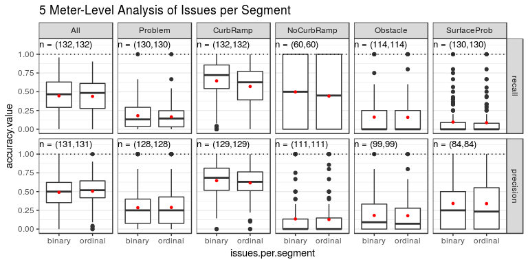

Statistics for Paper
================
Mikey Saugstad
April 6, 2018

-   [Public Deployment](#public-deployment)
    -   [High-level results](#high-level-results)
        -   [Top-line numbers (no filtering)](#top-line-numbers-no-filtering)
        -   [Data characteristics](#data-characteristics)
        -   [User stats and tool usage](#user-stats-and-tool-usage)
    -   [Possible Stories](#possible-stories)
        -   [Data overlap and agreement between users](#data-overlap-and-agreement-between-users)
        -   [Stickyness of tool: user dropoffs](#stickyness-of-tool-user-dropoffs)
-   [Turk Study](#turk-study)
    -   [High level results](#high-level-results-1)
        -   [Ground truth label counts](#ground-truth-label-counts)
        -   [Aggregate accuracy](#aggregate-accuracy)
        -   [Accuracy by user group](#accuracy-by-user-group)
        -   [Voting: Improved recall when at least one turker marks](#voting-improved-recall-when-at-least-one-turker-marks)
        -   [Descriptive stats for users](#descriptive-stats-for-users)
        -   [IRR](#irr)
        -   [Zone types](#zone-types)
    -   [Possible Stories](#possible-stories-1)
        -   [Granularity: Street-level vs 5 meter-level](#granularity-street-level-vs-5-meter-level)
        -   [Zone type: Land use effect on accuracy](#zone-type-land-use-effect-on-accuracy)
        -   [User behavior: Does auditing speed, etc. influence accuracy](#user-behavior-does-auditing-speed-etc.-influence-accuracy)
        -   [User group: Reg vs anon vs turk1 vs turk3 vs turk5](#user-group-reg-vs-anon-vs-turk1-vs-turk3-vs-turk5)
        -   [Low severity: Removing low severity effect on recall](#low-severity-removing-low-severity-effect-on-recall)
        -   [Binary vs ordinal issues per segment](#binary-vs-ordinal-issues-per-segment)

Public Deployment
=================

NOTE: Public deployment data includes all data up through March 31st (and part of April 1st). This includes all data through the most recent deployment on mturk.

High-level results
------------------

### Top-line numbers (no filtering)

TODO: Decide how to cluster production labels

The following are the label counts (not issue counts) by user group and label type.

| label\_type    | Anon         | Registered    | Turker         | Researcher    | Total           |
|:---------------|:-------------|:--------------|:---------------|:--------------|:----------------|
| CurbRamp       | 16557 (6.6%) | 28085 (11.2%) | 89766 (35.7%)  | 18686 (7.4%)  | 153094 (60.8%)  |
| NoCurbRamp     | 2510 (1.0%)  | 3447 (1.4%)   | 13509 (5.4%)   | 1198 (0.5%)   | 20664 (8.2%)    |
| Obstacle       | 1139 (0.5%)  | 2829 (1.1%)   | 16154 (6.4%)   | 1517 (0.6%)   | 21639 (8.6%)    |
| SurfaceProblem | 804 (0.3%)   | 1898 (0.8%)   | 3216 (1.3%)    | 2603 (1.0%)   | 8521 (3.4%)     |
| NoSidewalk     | 2370 (0.9%)  | 6357 (2.5%)   | 28408 (11.3%)  | 8031 (3.2%)   | 45166 (17.9%)   |
| Occlusion      | 69 (0.0%)    | 310 (0.1%)    | 462 (0.2%)     | 453 (0.2%)    | 1294 (0.5%)     |
| Other          | 93 (0.0%)    | 148 (0.1%)    | 1137 (0.5%)    | 39 (0.0%)     | 1417 (0.6%)     |
| Total          | 23542 (9.3%) | 43074 (17.1%) | 152652 (60.6%) | 32527 (12.9%) | 251795 (100.0%) |

### Data characteristics

This is the start of filtering out users with low labeling frequency (also filtering out researchers).

| CurbRamp | NoCurbRamp | NoSidewalk | Obstacle | Occlusion | Other | SurfaceProblem | Total  |
|:---------|:-----------|:-----------|:---------|:----------|:------|:---------------|:-------|
| 89293    | 9256       | 32560      | 18174    | 685       | 1074  | 4722           | 155764 |

There have been a total of 19768 audits by our users across 13045 streets, averaging 1.52 audits per street.

### User stats and tool usage

TODO: Missions started vs missions completed (not sure we can do this; I expect it to be difficult, without much benefit).

Below are the medians for a few metrics (followed by sums), split by user group. For all user groups, the minimum threshold to be included in this list was that they have completed at least one audit task and that their labeling threshold is above 3.75 labels per 100 meters.

NOTE: A "session" below is defined as a sequence of audit task interactions for a user where the minimum time between consecutive interactions is less than one hour.

| role       | n\_users | miles | km    | missions | audits | minutes\_audited | km\_per\_hr | m\_per\_min | minutes\_per\_1k\_ft | labels | labels\_per\_100m | sessions | mins\_per\_sess |
|:-----------|:---------|:------|:------|:---------|:-------|:-----------------|:------------|:------------|:---------------------|:-------|:------------------|:---------|:----------------|
| Anonymous  | 371      | 0.081 | 0.130 | 0        | 1.0    | 9.24             | 0.868       | 14.462      | 21.077               | 21     | 14.868            | 2        | 5.295           |
| Turker     | 130      | 0.348 | 0.560 | 4        | 4.5    | 24.09            | 1.428       | 23.808      | 12.803               | 57     | 10.476            | 1        | 22.685          |
| Registered | 190      | 0.544 | 0.875 | 4        | 8.0    | 28.65            | 2.387       | 39.788      | 7.661                | 73     | 7.278             | 1        | 19.818          |

| role       | n\_users | miles | km   | coverage | missions | audits | hours\_audited | labels | &gt;1 sess |
|:-----------|:---------|:------|:-----|:---------|:---------|:-------|:---------------|:-------|:-----------|
| Anonymous  | 371      | 89    | 143  | 8.3%     | 370      | 1333   | 92             | 14159  | 73%        |
| Turker     | 130      | 1018  | 1639 | 95%      | 3097     | 13234  | 446            | 104907 | 22%        |
| Registered | 190      | 394   | 634  | 37%      | 1226     | 5201   | 159            | 36939  | 37%        |

Possible Stories
----------------

### Data overlap and agreement between users

Amongst all the data collected in DC, how much of DC is labeled by multiple users and what is the disagreement amongst them? (see comment in Outline document for details on implementation)

### Stickyness of tool: user dropoffs

We want a bar chart here showing, after a user clicks start mapping, what percentage finish the tutorial, what percentage finish a mission, etc.

Turk Study
==========

Update: This is now all of the data. There used to be 19 anonymous user routes, but three of them actually had no labels placed by the anonymous user (we had forgotten to check beforehand), thus we have only 16.

Even though 5 turkers did each route, the high level results for individual turkers looks only at the first turker to complete each set of routes. This makes aggregate stats more even, and a fairer comparison across user groups. (but maybe we should actually use all turkers when not aggregating, actually...)

High level results
------------------

TODO: Come up with our own zone type descriptions, possibly aggregating as well.   TODO: Add "n" to a bunch of graphs.   TODO: Percentage of turkers who completed the HIT (maybe?).

### Ground truth label counts

Below is a table showing number of ground truth labels by user group and by label type.

| worker.type | All    | Problem | CurbRamp | NoCurbRamp | Obstacle | SurfaceProb |
|:------------|:-------|:--------|:---------|:-----------|:---------|:------------|
| anon        | 775    | 297     | 478      | 19         | 59       | 219         |
| reg         | 3842   | 1108    | 2734     | 68         | 236      | 804         |
| total       | 4617   | 1405    | 3212     | 87         | 295      | 1023        |
| % of total  | 100.0% | 30.4%   | 69.6%    | 1.9%       | 6.4%     | 22.2%       |

A total of 330 turkers, 50 registered users, and 16 anonymous users were part of this study.

### Aggregate accuracy

Below are two tables (street level, then 5 meter level) showing average (median) accuracy across all users when aggregating over all label types, and for problem vs no problem. We see that the accuracies are comparable at the street level, but accuracy is much higher for curb ramps than problems at the 5 meter level.

NOTE: In these two tables, the data is binary (not ordinal), we are only considering single users auditing (i.e., no multi-user clustering or majority vote), and we only consider the first turker to audit each route.

Median accuracy across all users - street level:

| label.type | recall | precision | f.measure |
|:-----------|:-------|:----------|:----------|
| All        | 0.714  | 0.674     | 0.667     |
| Problem    | 0.714  | 0.714     | 0.667     |

Median accuracy across all users - 5 meter level:

| label.type | recall | precision | f.measure |
|:-----------|:-------|:----------|:----------|
| All        | 0.543  | 0.472     | 0.468     |
| Problem    | 0.200  | 0.250     | 0.222     |

### Accuracy by user group

Then we show the above accuracy measures (but for only precision, recall, and f-measure), as an average (median) per user group. These are again as an aggregate across all label types (all.\*) and for the problem vs no problem type (prob.\*).

NOTE: In these two tables, the data is binary (not ordinal).

Median accuracy by user group - street level:

| user.type | all.recall | all.prec | all.f.meas | prob.recall | prob.prec | prob.f.meas |
|:----------|:-----------|:---------|:-----------|:------------|:----------|:------------|
| anon      | 0.523      | 0.780    | 0.667      | 0.292       | 1.000     | 0.500       |
| reg       | 0.771      | 0.636    | 0.667      | 0.800       | 0.667     | 0.727       |
| turk1     | 0.707      | 0.700    | 0.648      | 0.667       | 0.750     | 0.667       |
| turk3     | 0.620      | 0.815    | 0.700      | 0.571       | 0.800     | 0.667       |
| turk5     | 0.571      | 0.917    | 0.698      | 0.333       | 1.000     | 0.500       |

Median accuracy by user group - 5 meter level:

| user.type | all.recall | all.prec | all.f.meas | prob.recall | prob.prec | prob.f.meas |
|:----------|:-----------|:---------|:-----------|:------------|:----------|:------------|
| anon      | 0.415      | 0.664    | 0.552      | 0.066       | 0.417     | 0.154       |
| reg       | 0.589      | 0.420    | 0.460      | 0.250       | 0.229     | 0.231       |
| turk1     | 0.490      | 0.489    | 0.471      | 0.200       | 0.267     | 0.211       |
| turk3     | 0.509      | 0.667    | 0.559      | 0.125       | 0.286     | 0.205       |
| turk5     | 0.504      | 0.750    | 0.584      | 0.071       | 0.333     | 0.167       |

### Voting: Improved recall when at least one turker marks

Since dealing with false positives is pretty easy (relative to walking through GSV), the most important thing for us is to maximize recall. So how does recall look if we consider a label placed by at least one turker as a potential attribute (i.e., we use the "at least one" voting method)?

For reference, registered users tended to have the best performance among our user groups, and their recall for problem vs no problem was 0.8 and their precision was 0.67.

NOTE: In this section we are looking at *problem vs no problem*, the data are binary (not ordinal), the data are at the street level (not 5 meter level), and we are looking at 5 clustered turkers with the "at least one" voting method.

*Takeaways*:

-   The median recall is actually perfect for street level when using this other voting method, and the precision is still at 0.67, which isn't bad at all! This actually gives 5 turkers higher recall than registered users, and their precision is equal.

-   It would be interesting to see what this looks like at the 5 meter level as well.

| voting.method | recall | precision |
|:--------------|:-------|:----------|
| majority.vote | 0.333  | 1.000     |
| at.least.one  | 1.000  | 0.667     |

### Descriptive stats for users

Next we have some descriptive statistics of users, by user group. These are average (median) stats.

NOTE: In this table, we are only considering single users auditing (i.e., no multi-user clustering or majority vote), and we only consider the first turker to audit each route.

| worker.type | labels.per.100m | km.per.hr | m.per.min | minutes.per.1k.ft | minutes\_audited |
|:------------|:----------------|:----------|:----------|:------------------|:-----------------|
| anon        | 4.921           | 2.853     | 47.547    | 6.418             | 12.835           |
| reg         | 5.988           | 3.108     | 51.794    | 5.893             | 23.570           |
| turk1       | 7.669           | 1.864     | 31.067    | 9.818             | 33.350           |

Below, we have a table of aggregate (sum) stats by user group.

NOTE: In this table, we are only considering single users auditing (i.e., no multi-user clustering or majority vote), and we only consider the first turker to audit each route.

| worker.type | n.missions | distance.miles | distance.km | n.labels | hours.audited |
|:------------|:-----------|:---------------|:------------|:---------|:--------------|
| anon        | 32         | 6.061          | 9.754       | 499      | 3.811         |
| reg         | 150        | 37.879         | 60.960      | 3696     | 21.631        |
| turk1       | 182        | 43.939         | 70.714      | 5711     | 41.103        |

### IRR

Our average (mean) IRR over the 7 rounds, by label type, is in the table below:

NOTE: In this table, the data is binary (not ordinal), and is at the street level (not 5 meter level).

| label.type  | mean.kripp.alpha |
|:------------|:-----------------|
| CurbRamp    | 0.907            |
| NoCurbRamp  | 0.787            |
| Obstacle    | 0.342            |
| SurfaceProb | 0.477            |
| Problem     | 0.475            |

### Zone types

Here is the zone type distribution for the mturk study. This shows the distribution of zone type for the routes that we took from anonymous and registered users and compare it to the distribution across all of DC. There are three zone types where anonymous users have no data, but registered users do. So the second graph shows the distribution when we remove the sets of routes from registered users the contain data from those three zone types. We will likely use the second set of data for comparison between the user groups. This removes 13 of the 50 sets of routes from registered users. There is still 16 sets of routes from anonymous users.

Possible Stories
----------------

### Granularity: Street-level vs 5 meter-level

Below we compare street vs 5 meter level recall and precision by label type.

NOTE: In this section, the data is binary (not ordinal), we are only considering single users auditing (i.e., no multi-user clustering or majority vote), and we only consider the first turker to audit each route.

NOTE: This is a rare case where we are using the mean, since we are also showing standard error at the same time.

*Takeaways*:

-   Analyzing at the 5 meter level shows higher raw accuracy and specificity, both because of the large number of true negatives that we get from splitting into 5 meter segments; there are very few street segments with no labels at all.

-   Analyzing at the street level shows higher recall, implying that there were relatively fewer false negatives at the street level. This may mean that users aren't finding *every* issue, but they are more likely to find *at least one* issue of that type when there are multiple that occur on the same street.

-   Analyzing at the street level shows higher precision, implying that there were relatively fewer false positives at the street level. I suspect that this is due to fundamental misunderstandings about how to label (implying both that labeling is complex and difficult and that our onboarding is insufficient) which are persistent/consistent and frequent (think: labeling driveways as curb ramps, labeling storm drains as missing curb ramps, and labeling fire hydrants or street signs that are not in the way as obstacles). In those cases where the mistake is made frequently (multiple times per street), relatively fewer false positives makes sense when moving to street level analysis.

-   Analyzing at the street level shows higher f-measure. This clearly comes from the higher recall and precision.

-   CurbRamp pretty much outperforms all other lable types across the board, regardless of accuracy type of 5 meter vs. street level. This is likely because curb ramps are the easiest label type to understand and find in GSV (both because they are large and easy to see, and because you know where to expect them -- at intersections).

-   The SurfaceProblem label type seems to have the highest precision and lowest recall among the different types of issues (I'm excluding CurbRamp here). I guess that, relative to the other types of issues, there are just fewer cases of mistaking something of a surface problem and more cases of not finding a surface problem that was vsisible in GSV (so maybe surface problems require increased diligence from users, and the other issues require better treatment in onboarding).

-   The Problem type seems to perform better than the surface problem and obstacle label types (except for surface problem precision, mentioned in the previous bullet).

-   NoCurbRamp seems to have high recall and low precision. This fits my intuition; since users know to expect curb ramps at intersections, if they arrive at an intersection and a curb ramp is not there, they know to place a NoCurbRamp label. However, if there was no sidewalk at all, then we did not add the missing curb ramp labels to the ground truth dataset, and this is not something that we covered during onboarding. I suspect that this, paired with users marking storm drains as missing curb ramps, were the main reasons for the low recall. Both could be addressed through proper training.

### Zone type: Land use effect on accuracy

The first graph shows all label types aggregated, the second shows the problem vs. no problem type.

NOTE: In this section, the data is binary (not ordinal), and is at the street level (not 5 meter level), we are only considering single users auditing (i.e., no multi-user clustering or majority vote), and we only consider the first turker to audit each route.

NOTE: The red dots on the graphs are means.

*Takeaways*:

### User behavior: Does auditing speed, etc. influence accuracy

Below we investigate how user behavior is associated with performance in our turk study. The graphs below are more exploratory. I am not sure that we can be guaranteed any statistical significance by simply looking at the graphs below. We can always formulate hypothesis tests once we narrow down what we want to look at.

NOTE: In this section, the data are binary (not ordinal), at the street level granularity (not 5 meter level) we are only considering single users auditing (i.e., no multi-user clustering or majority vote), and we only consider the first turker to audit each route.

For the second graph, we are only looking at users with a speed of less than 100 meters per minute, because only 5 users (3.8%) had speeds higher than that. The max speed was 181 meters per minute.

*Takeaways*:

-   Labeling frequency seems to have a positive relationship with recall, which is what we would have expected.

-   Labeling frequency seems to have a more positive relationship with the Problem (vs no problem) type than for the all label types combined (at least for the highest labeling frequencies, greater than 15 labels per 100m). I would think that, for the highest labeling frequencies, this comes from users who are labeling driveways as curb ramps. This would hurt their curb ramp precision, but not Problem type precision.

-   Auditing speed did not seem to have a big impact on performance by itself.

### User group: Reg vs anon vs turk1 vs turk3 vs turk5

TODO: Make some graphs.

*Takeaways*:

### Low severity: Removing low severity effect on recall

Below is a table with counts of ground truth labels in the dataset at different severity thresholds. This is followed by a trellis plot that shows how recall changes when we remove low severity problems from the ground truth dataset. This is shown by label type and user group.

NOTE: In this section, the data is binary (not ordinal), and is at the street level (not 5 meter level).

*Takeaways*:

-   Only 17% of surface problems and 35% of obstacles had severity of 3 or higher. Most missing curb ramps are high severity (not surprising).

-   The general trend is a decent improvement in recall when we remove high severity labels from the ground truth.

-   Note that it *is* possible for the recall to get worse when removing high severity labels. This is because certain users may have found more of the low severity problems than the high severity ones.

| low.severity.thresh | Problem | NoCurbRamp | Obstacle | SurfaceProb |
|:--------------------|:--------|:-----------|:---------|:------------|
| baseline            | 1405    | 87         | 295      | 1023        |
| &gt;=3              | 352     | 74         | 106      | 172         |
| &gt;=4              | 158     | 42         | 54       | 62          |

### Binary vs ordinal issues per segment

For simplicity, the first graph looks at the 5 meter level, and the second looks at street level. All user groups are also combined (the groups being: registered volunteers, anonymous volunteers, and individual turkers).

NOTE: In this section, the data is at the street level (not 5 meter level), we are only considering single users auditing (i.e., no multi-user clustering or majority vote), and we only consider the first turker to audit each route.

NOTE: The red dots on the graphs are means.

*Takeaways*:

-   5 meter level (first graph): Considering multiple issues per segment results in *very slightly* lower accuracy for pretty much every type of label and type of accuracy (except precision). I suspect that this comes mostly from our method of clustering, which makes it unlikely that users end up with multiple labels per 5 meter segment. We do not have this restriction in the ground truth, so those few cases where we have more than one label per 5 meter segment in the GT usually results in an additional false negative when moving to ordinal analysis. However, the difference here is very small, so our clustering method seems fine to me.

-   Street level (second graph) recall: If we do this analysis at the street level, the decreases in accuracy are more pronounced. At this level, the clustering shouldn't have much effect. The decrease in recall suggests that users are finding *some* of the problems, but not *all* of them (meaning an increase in false negatives when we move to ordinal analysis).

-   Street level (second graph) recall: I suspect that the reason for the decrease in precision when moving to ordinal analysis at the street level is the same reason as why 5 meter level has lower precision than street level (seen in the previous section). That is, users' misunderstandings of how to label certain common things (driveways as curb ramps, etc.); since these mistakes are common, they may happen many times on a single street edge, which means that you start racking up the false positives when you move to ordinal analysis.

