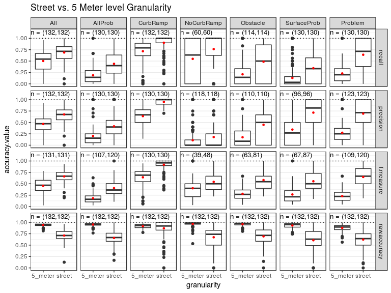
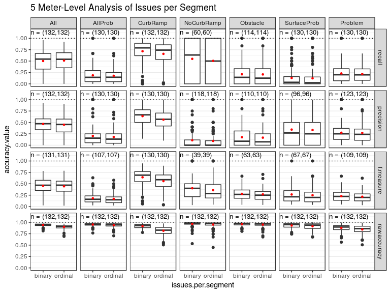
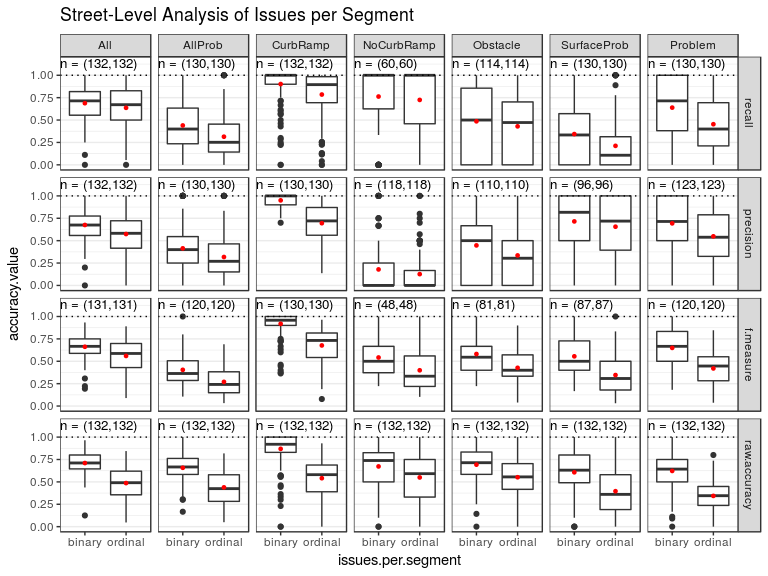
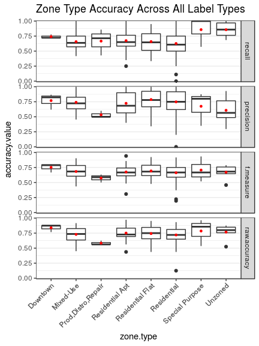
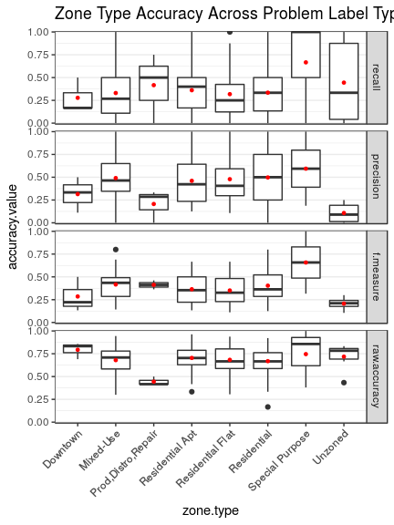

Statistics for Paper
================
Mikey Saugstad
April 6, 2018

-   [Public Deployment](#public-deployment)
    -   [Top-line numbers (no filtering)](#top-line-numbers-no-filtering)
    -   [Data characteristics](#data-characteristics)
    -   [User stats and tool usage](#user-stats-and-tool-usage)
    -   [Possible Story 1: Data overlap and agreement between users](#possible-story-1-data-overlap-and-agreement-between-users)
-   [Turk Study](#turk-study)
    -   [High level results](#high-level-results)
    -   [Possible Story 1: Street-level vs. 5 meter-level](#possible-story-1-street-level-vs.-5-meter-level)
    -   [Possible Story 2: Binary vs. ordinal issues per segment](#possible-story-2-binary-vs.-ordinal-issues-per-segment)
    -   [Possible Story 3: Zone type (land use) effect on accuracy](#possible-story-3-zone-type-land-use-effect-on-accuracy)
    -   [Possible Story 4: Reg vs. anon vs. turker vs. turk3 vs. turk5](#possible-story-4-reg-vs.-anon-vs.-turker-vs.-turk3-vs.-turk5)
    -   [Possible Story 5: Does removing low severity =&gt; higher recall](#possible-story-5-does-removing-low-severity-higher-recall)

Public Deployment
-----------------

NOTE: Public deployment data includes all data up through March 31st (and part of April 1st). This includes all data through the most recent deployment on mturk.

### Top-line numbers (no filtering)

| CurbRamp | NoCurbRamp | NoSidewalk | Obstacle | Occlusion | Other | SurfaceProblem | Total  |
|:---------|:-----------|:-----------|:---------|:----------|:------|:---------------|:-------|
| 153094   | 20664      | 45166      | 21639    | 1294      | 1417  | 8521           | 251795 |

### Data characteristics

This is the start of filtering out users with low labeling frequency (also filtering out researchers).

| CurbRamp | NoCurbRamp | NoSidewalk | Obstacle | Occlusion | Other | SurfaceProblem | Total  |
|:---------|:-----------|:-----------|:---------|:----------|:------|:---------------|:-------|
| 89293    | 9256       | 32560      | 18174    | 685       | 1074  | 4722           | 155764 |

There have been a total of 19768 audits by our users across 13045 streets, averaging 1.52 audits per street.

### User stats and tool usage

TODO: Missions started vs missions completed (not sure we can do this; I expect it to be difficult, without much benefit).

Below are the medians for a few metrics (followed by sums), split by user group. For all user groups, the minimum threshold to be included in this list was that they have completed at least one audit task and that their labeling threshold is above 3.75 labels per 100 meters.

| role       | n\_users | miles | missions | audits | minutes\_audited | minutes\_per\_1k\_ft | labels | labels\_per\_100m | sessions | mins\_per\_sess |
|:-----------|:---------|:------|:---------|:-------|:-----------------|:---------------------|:-------|:------------------|:---------|:----------------|
| Anonymous  | 371      | 0.081 | 0        | 1.0    | 8.80             | 18.908               | 21     | 14.868            | 2        | 4.590           |
| Turker     | 130      | 0.348 | 4        | 4.5    | 24.09            | 12.803               | 57     | 10.476            | 1        | 22.685          |
| Registered | 190      | 0.544 | 4        | 8.0    | 28.65            | 7.661                | 73     | 7.278             | 1        | 19.818          |

| role       | n\_users | miles    | coverage | missions | audits | hours\_audited | labels | &gt;1 sess |
|:-----------|:---------|:---------|:---------|:---------|:-------|:---------------|:-------|:-----------|
| Anonymous  | 371      | 88.834   | 8.3%     | 370      | 1333   | 85.369         | 14159  | 73%        |
| Turker     | 130      | 1018.386 | 95%      | 3097     | 13234  | 445.934        | 104907 | 22%        |
| Registered | 190      | 394.097  | 37%      | 1226     | 5201   | 158.970        | 36939  | 37%        |

### Possible Story 1: Data overlap and agreement between users

Amongst all the data collected in DC, how much of DC is labeled by multiple users and what is the disagreement amongst them? (see comment in Outline document for details on implementation)

Turk Study
----------

Update: This is now all of the data. There used to be 19 anonymous user routes, but three of them actually had no labels placed by the anonymous user (we had forgotten to check beforehand), thus we have only 16.

Even though 5 turkers did each route, the high level results for individual turkers looks only at the first turker to complete each set of routes. This makes aggregate stats more even, and a fairer comparison across user groups. (but maybe we should actually use all turkers when not aggregating, actually...)

### High level results

TODO: Add turk3 and turk5 to the user groups (3 and 5 turkers with majority vote, respectively).   TODO: Come up with our own zone type descriptions, possibly aggregating as well.   TODO: Add street level high level results (maybe?).   TODO: Add "n" to a bunch of graphs.   TODO: Percentage of turkers who completed the HIT (maybe?).

A total of 330 turkers, 50 registered users, and 16 anonymous users were part of this study.

First is a table showing average (median) accuracy across all users when aggregating over all label types, and when aggregating over just the problem label types (missing curb ramp, surface problem, and obstacle). We show all the different accuracy types. We see that the first set of numbers is much higher, because curb ramp accuracy is very high in general. When we remove curb ramps in the second set of numbers, they become very low.

| label.type | precision | recall | specificity | f.measure | raw.accuracy |
|:-----------|:----------|:-------|:------------|:----------|:-------------|
| All        | 0.486     | 0.702  | 0.969       | 0.553     | 0.955        |
| AllProb    | 0.077     | 0.250  | 0.978       | 0.222     | 0.972        |

Then we show the above accuracy measures (but for only precision, recall, and f-measure), as an average (median) per user group.

| worker.type | total.recall | total.precision | total.f.measure | problem.recall | problem.precision | problem.f.measure |
|:------------|:-------------|:----------------|:----------------|:---------------|:------------------|:------------------|
| anon        | 0.569        | 0.719           | 0.667           | 0.225          | 0.292             | 0.286             |
| reg         | 0.921        | 0.488           | 0.590           | 0.600          | 0.183             | 0.251             |
| turk        | 0.768        | 0.672           | 0.690           | 0.477          | 0.150             | 0.203             |

Next we have some descriptive statistics of users, by user group. These are average (median) stats.

| worker.type | labels.per.100m | feet.per.min | minutes.per.1k.ft | minutes\_audited |
|:------------|:----------------|:-------------|:------------------|:-----------------|
| anon        | 4.921           | 150.830      | 6.630             | 13.260           |
| reg         | 5.988           | 163.800      | 6.105             | 24.420           |
| turk        | 6.808           | 628.456      | 1.591             | 6.365            |

Below, we have a table of aggregate (sum) stats by user group.

| worker.type | n.missions | distance.miles | n.labels | hours.audited |
|:------------|:-----------|:---------------|:---------|:--------------|
| anon        | 32         | 6.061          | 481      | 3.547         |
| reg         | 150        | 37.879         | 3626     | 21.518        |
| turk        | 182        | 43.939         | 5559     | 9.037         |

Our average (mean and median) IRR over the 7 rounds, by label type, is in the table below:

| label.type  | mean.kripp.alpha | median.kripp.alpha |
|:------------|:-----------------|:-------------------|
| CurbRamp    | 0.958            | 0.962              |
| NoCurbRamp  | 0.763            | 0.844              |
| Obstacle    | 0.397            | 0.398              |
| SurfaceProb | 0.438            | 0.454              |
| Problem     | 0.535            | 0.547              |

Here is the zone type distribution for the mturk study. This shows the distribution of zone type for the routes that we took from anonymous and registered users and compare it to the distribution across all of DC. There are three zone types where anonymous users have no data, but registered users do. So the second graph shows the distribution when we remove the sets of routes from registered users the contain data from those three zone types. We will likely use the second set of data for comparison between the user groups. This removes 13 of the 50 sets of routes from registered users. There is still 16 sets of routes from anonymous users.

### Possible Story 1: Street-level vs. 5 meter-level

For simplicity, the graphs below count only one true/false positie/negative per segment, instead of counting the number of labels in that segment (i.e., binary instead of ordinal). All user groups are also combined (the groups being: registered volunteers, anonymous volunteers, and individual turkers).

Note: The red dots on the graphs are means.

*Takeaways*:

-   Analyzing at the 5 meter level shows higher raw accuracy and specificity, both because of the large number of true negatives that we get from splitting into 5 meter segments; there are very few street segments with no labels at all.

-   Analyzing at the street level shows higher recall, implying that there were relatively fewer false negatives at the street level. This may mean that users aren't finding *every* issue, but they are more likely to find *at least one* issue of that type when there are multiple that occur on the same street.

-   Analyzing at the street level shows higher precision, implying that there were relatively fewer false positives at the street level. I suspect that this is due to fundamental misunderstandings about how to label (implying both that labeling is complex and difficult and that our onboarding is insufficient) which are persistent/consistent and frequent (think: labeling driveways as curb ramps, labeling storm drains as missing curb ramps, and labeling fire hydrants or street signs that are not in the way as obstacles). In those cases where the mistake is made frequently (multiple times per street), relatively fewer false positives makes sense when moving to street level analysis.

-   Analyzing at the street level shows higher f-measure. This clearly comes from the higher recall and precision.

-   CurbRamp pretty much outperforms all other lable types across the board, regardless of accuracy type of 5 meter vs. street level. This is likely because curb ramps are the easiest label type to understand and find in GSV (both because they are large and easy to see, and because you know where to expect them -- at intersections).

-   The SurfaceProblem label type seems to have the highest precision and lowest recall among the different types of issues (I'm excluding CurbRamp here). I guess that, relative to the other types of issues, there are just fewer cases of mistaking something of a surface problem and more cases of not finding a surface problem that was vsisible in GSV (so maybe surface problems require increased diligence from users, and the other issues require better treatment in onboarding).

-   The Problem type seems to perform better than the surface problem and obstacle label types (except for surface problem precision, mentioned in the previous bullet).

-   NoCurbRamp seems to have high recall and low precision. This fits my intuition; since users know to expect curb ramps at intersections, if they arrive at an intersection and a curb ramp is not there, they know to place a NoCurbRamp label. However, if there was no sidewalk at all, then we did not add the missing curb ramp labels to the ground truth dataset, and this is not something that we covered during onboarding. I suspect that this, paired with users marking storm drains as missing curb ramps, were the main reasons for the low recall. Both could be addressed through proper training.

### Possible Story 2: Binary vs. ordinal issues per segment

For simplicity, the first graph looks at the 5 meter level, and the second looks at street level. All user groups are also combined (the groups being: registered volunteers, anonymous volunteers, and individual turkers).

Note: The red dots on the graphs are means.

*Takeaways*:

-   5 meter level (first graph): Considering multiple issues per segment results in *very slightly* lower accuracy for pretty much every type of label and type of accuracy (except precision). I suspect that this comes mostly from our method of clustering, which makes it unlikely that users end up with multiple labels per 5 meter segment. We do not have this restriction in the ground truth, so those few cases where we have more than one label per 5 meter segment in the GT usually results in an additional false negative when moving to ordinal analysis. However, the difference here is very small, so our clustering method seems fine to me.

-   Street level (second graph) recall: If we do this analysis at the street level, the decreases in accuracy are more pronounced. At this level, the clustering shouldn't have much effect. The decrease in recall suggests that users are finding *some* of the problems, but not *all* of them (meaning an increase in false negatives when we move to ordinal analysis).

-   Street level (second graph) recall: I suspect that the reason for the decrease in precision when moving to ordinal analysis at the street level is the same reason as why 5 meter level has lower precision than street level (seen in the previous section). That is, users' misunderstandings of how to label certain common things (driveways as curb ramps, etc.); since these mistakes are common, they may happen many times on a single street edge, which means that you start racking up the false positives when you move to ordinal analysis.

### Possible Story 3: Zone type (land use) effect on accuracy

The first graph shows all label types aggregated, the second shows only problem label types aggregated.

Note: The red dots on the graphs are means.

*Takeaways*:

### Possible Story 4: Reg vs. anon vs. turker vs. turk3 vs. turk5

TODO: Make some graphs.

*Takeaways*:

### Possible Story 5: Does removing low severity =&gt; higher recall

TODO: Make some graphs.

*Takeaways*:
